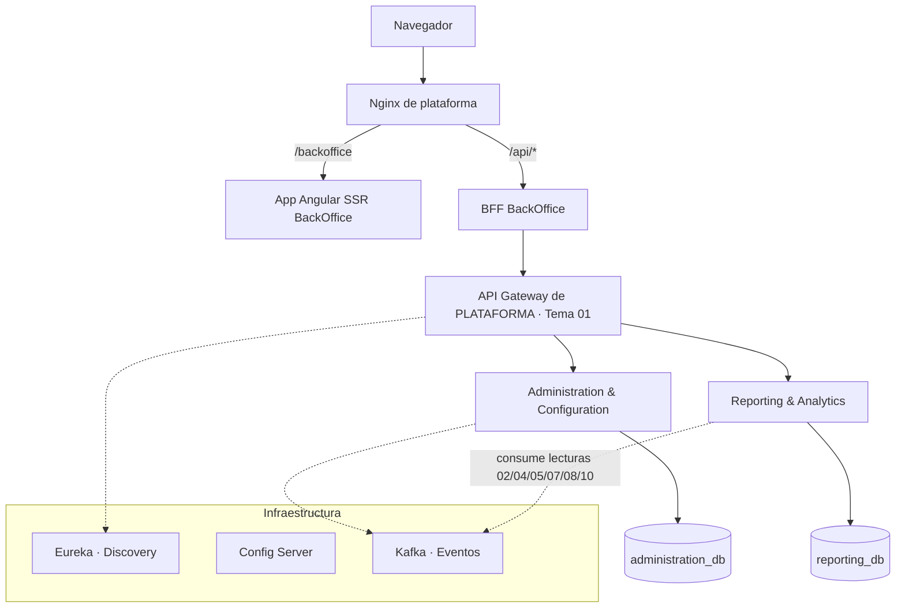
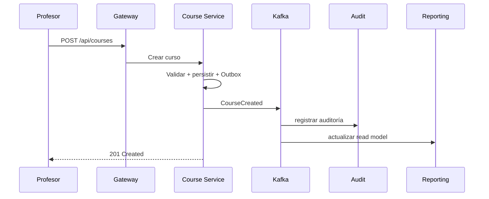

# BackOffice — Resumen Visual

> Plataforma de Aprendizaje Gamificado de Programación y Desarrollo de Software
> **Alcance:** Backend del módulo **BackOffice** — administración de plataforma · proveedores de modelo (exclusiva ADMIN) · reportes docentes · métricas de curso · exportación de datos
> **Stack:** Java 21 · Spring Boot 3 · Maven

---

## ¿Qué hace el BackOffice?

Es el **backend administrativo** que usan ADMIN y PROFESOR para operar la plataforma, con trazabilidad y seguridad.

| Rol | Qué puede hacer | Alcance de datos |
|---|---|---|
| **ADMIN** | Administración de plataforma, config global, proveedores de modelo, auditoría, reportes globales | Toda la plataforma |
| **PROFESOR** | Reportes y métricas de sus cursos | Sus cursos |

> **Fuera de alcance (otros equipos):** cursos, desafíos, usuarios (onboarding/avatar), gamificación, ranking, chat, notificaciones, encuestas de alumno, IA como producto. El BackOffice los **consume** vía eventos.

---

## Arquitectura en una imagen

> El **frontend** está **definido (Caso A)**: app Angular SSR + Nginx + **BFF por experiencia** (del equipo BackOffice) — ver página `frontend/arquitectura-despliegue`. Este documento cubre el módulo completo (backend + front).
> **Tema 12 — Backoffice (consumidor puro):** 2 servicios propietarios; identidad/roles/auditoría (T01), cohorte (T02) y lecturas de 02/04/05/07/08/10 se consumen.



**Principios:** Database per Service · Comunicación por API REST (sync por el gateway) + eventos (Kafka) · Outbox · Idempotencia · Autorización en Gateway **y** en cada servicio · Correlation ID · **Service Discovery (Eureka)**: los microservicios se registran al iniciar y el Gateway consulta su ubicación para enrutar.

---

## Los 2 servicios propietarios

| Servicio | Responsabilidad | Base |
|---|---|---|
| **Administration & Configuration** | PAR-01..24 + **proveedores/modelos de IA** (RF-IA-23/24/25/35), exclusiva ADMIN | administration_db |
| **Reporting & Analytics** | Reportes docentes, panel del profesor (alumno en riesgo), métricas CSAT, exportación, alertas | reporting_db |

**Consume (no implementa):** identidad/auth/roles/2FA/auditoría/retención → **Tema 01**; cohorte → **Tema 02**; lecturas → **Temas 02/04/05/07/08/10**.

---

## Stack tecnológico

| Capa | Tecnología |
|---|---|
| Lenguaje / Framework | Java 21 · Spring Boot 3 |
| Build | Maven (multi-módulo) |
| Gateway | Spring Cloud Gateway |
| Discovery | Eureka (Consul = alternativa) |
| Config | Spring Cloud Config Server |
| Mensajería | Kafka + Outbox (RabbitMQ = alternativa) |
| Persistencia | JPA/Hibernate · **PostgreSQL** (recomendada) |
| API docs | springdoc / OpenAPI 3 |
| Seguridad | Spring Security + JWT + 2FA (TOTP) |
| Pruebas | JUnit 5 · Mockito · Testcontainers · Spring Cloud Contract |

---

## Comunicación entre servicios

**Síncrona (REST):** cuando hace falta respuesta inmediata (consultas, validaciones).

**Asíncrona (eventos Kafka):** para desacoplar y propagar cambios. Topic por dominio + **consumer group por servicio** y **caché local con TTL 10 min** (el evento invalida antes; respaldo ante caída del Backoffice); Outbox + idempotencia por `event_id`/`version` para entrega confiable.



---

## Reglas de negocio críticas

- Nunca queda la plataforma **sin ADMIN activo** (incondicional, con concurrencia).
- Un ADMIN **no puede auto-eliminarse**; baja reforzada (contraseña + 2FA + confirmación).
- **No existe hard delete**: todo es baja lógica.
- Los cambios de configuración **rigen solo hacia adelante** (no se recalculan datos históricos).
- La **gestión de proveedores de modelo** es exclusiva de ADMIN (RF-IA-35) y auditada.
- Las encuestas se consumen solo como **agregados anónimos** (RF-ENC-04).
- **Frescura de lectura ≤ 15 min** y **sin comparación entre docentes**.
- La auditoría la persiste el **Tema 01** (el Backoffice emite los eventos).

---

## Contratos con otros equipos

| Flujo | Dependencia | Mecanismo |
|---|---|---|
| Config economía | Administration → Temas 03/05/08/10 | Evento `GlobalConfigurationChanged` (topic `administration.events`) |
| Proveedores de modelo | Administration → T07 | Evento `ModelProviderChanged` (topic `administration.events`) |
| Reportes/métricas | Reporting ← Temas 02/04/05/07/08/10 | **Contratos de lectura** (eventos/APIs por el gateway) |
| Autorización/auditoría | Backoffice → Tema 01 | Consume auth/roles/auditoría; gateway de plataforma |

---

## Repositorio (Maven multi-módulo)

```
backoffice-backend/
├── pom.xml
├── gateway/
├── discovery-server/          ← Eureka
├── config-server/
├── services/
│   ├── administration-service/
│   └── reporting-service/
├── building-blocks/           ← contracts, shared-kernel, security, observability
├── tests/
├── deploy/docker/
└── docker-compose.yml
```

> **Frontend (definido, Caso A):** app Angular SSR + BFF BackOffice + Nginx (web + reverse proxy `/api/*` → BFF). El backend expone APIs REST documentadas (OpenAPI) que el BFF consume a través del Gateway. Detalle: `frontend/arquitectura-despliegue`.

## Patrones de diseño aplicados (resumen)

- **Specification** → reglas compuestas (cambios de configuración/proveedor).
- **Strategy** → decisión de retención (consumida vía Tema 01).
- **Command + Decorator** → casos de uso + auditoría emitida al Tema 01.
- **Adapter / Null Object** → clientes externos (contratos de lectura) y fallback (RNF-06).
- **Observer + Outbox + Unit of Work** → eventos de dominio con entrega confiable.
- **Idempotency Key** → operaciones críticas (429/duplicados).

> Versión completa con RF, RNF, ADRs, endpoints, modelo de datos y trazabilidad: ver **`backoffice_backend_requerimientos_arquitectura.md`**.
