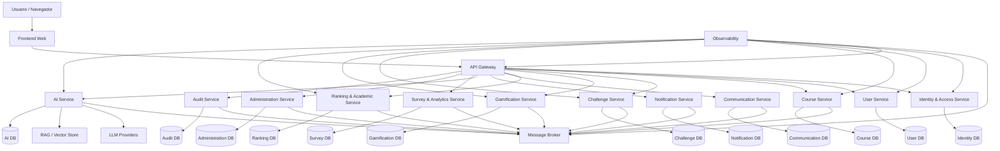
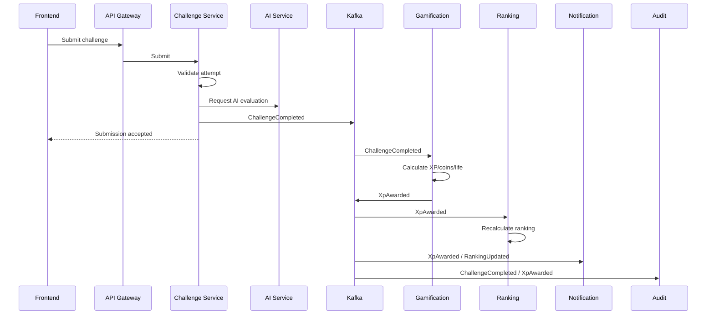
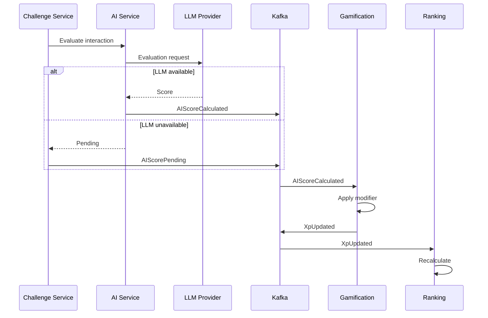
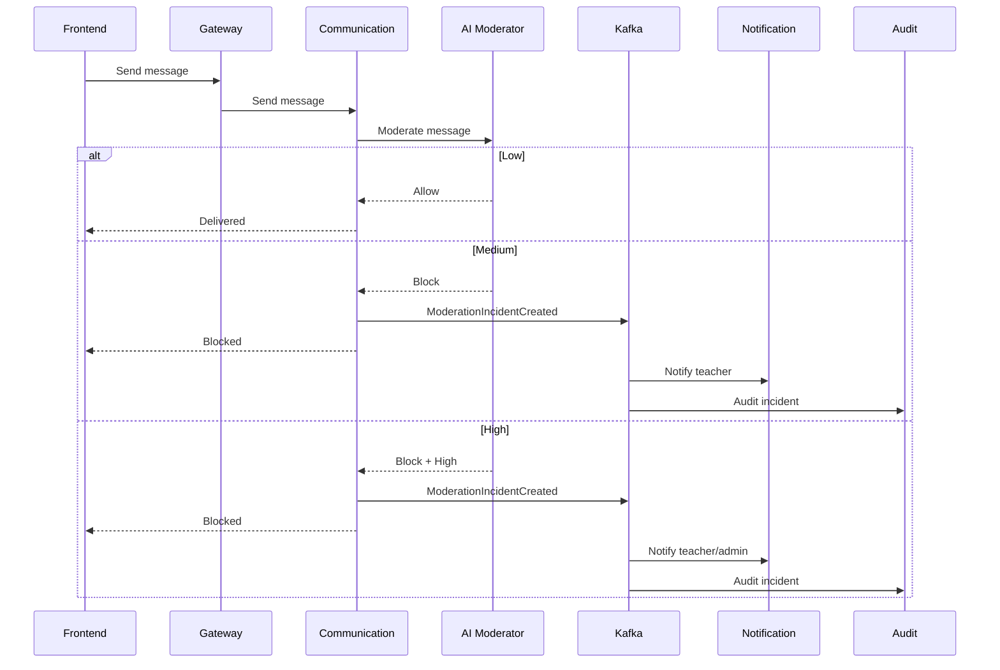
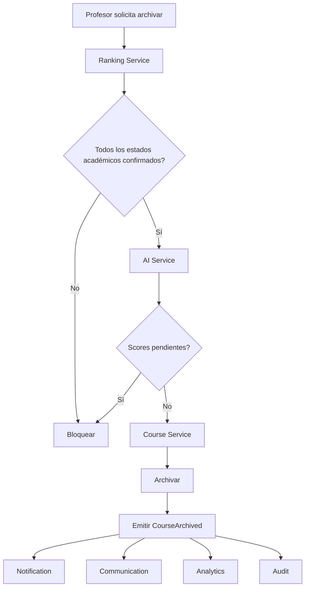
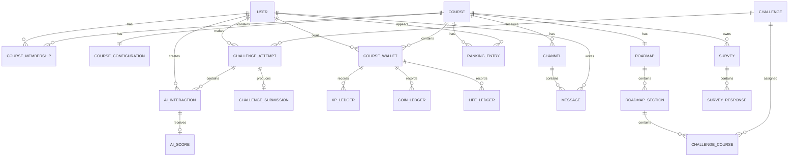
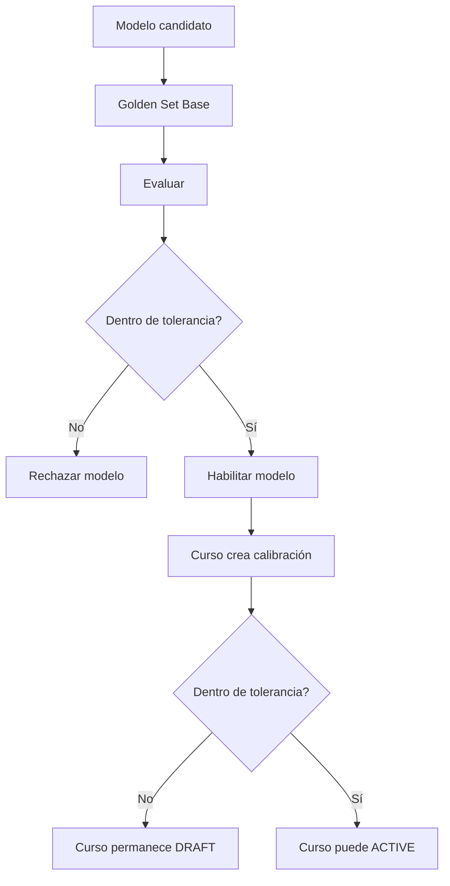

# Plataforma Gamificada de Programación y Desarrollo de Software
## Documento de Arquitectura – Microservicios Multitenant con Backoffice Centralizado

**Versión:** 2.0  
**Fecha:** 28/08/2026  
**Tipo de documento:** Arquitectura de software / Low Level Design preliminar  
**Base funcional:** PRD de la Plataforma de Aprendizaje Gamificado  
**Arquitectura obligatoria:** Microservicios  
**Estado:** Propuesta para revisión del equipo y docentes

---

# 1. Propósito del documento

Este documento define **cómo se implementará técnicamente** la plataforma definida en el PRD.

El PRD define el producto, sus reglas de negocio y sus restricciones. Este documento agrega las decisiones arquitectónicas necesarias para construirlo:

- estilo arquitectónico;
- límites de cada microservicio;
- comunicación síncrona y asíncrona;
- estrategia multitenant;
- modelo de datos;
- autenticación y autorización;
- persistencia;
- eventos;
- IA;
- auditoría;
- observabilidad;
- configuración;
- despliegue;
- estructura de carpetas;
- requerimientos funcionales y no funcionales;
- trazabilidad;
- riesgos técnicos;
- estrategia de pruebas.

> **Criterio:** cuando una decisión proviene directamente del PRD se identifica como **[PRD]**. Cuando se trata de una decisión técnica del equipo se identifica como **[ARQ]**. Las decisiones arquitectónicas no deben modificar reglas funcionales fijadas por el Product Owner.

---

# 2. Alcance

La plataforma es un sistema web de aprendizaje de programación y desarrollo de software con:

- cursos representados como roadmaps;
- desafíos teóricos y prácticos;
- gamificación mediante XP, monedas y vidas;
- niveles y ranking por curso;
- recompensas e intercambio;
- autenticación y autorización;
- onboarding y Guided Tour;
- chat;
- notificaciones;
- asistencia de IA;
- evaluación del uso de IA;
- moderación de contenido;
- RAG;
- encuestas anónimas;
- métricas y KPIs;
- auditoría;
- conservación y anonimización de información académica.

El PRD establece una implementación progresiva. El MVP contiene el núcleo funcional y las funcionalidades de mayor prioridad; Fase 2 y Fase 3 incorporan funcionalidades adicionales.

**Nota:** los profesores establecieron que el proyecto debe implementar **microservicios** como objetivo formativo. Por ese motivo, esta arquitectura adopta microservicios aun cuando algunas funcionalidades podrían resolverse con un monolito modular.

---

# 3. Principios arquitectónicos

## 3.1 Separación de responsabilidades

Cada microservicio representa un dominio funcional concreto y mantiene la lógica de negocio correspondiente a dicho dominio.

## 3.2 Bajo acoplamiento

Los microservicios no deben acceder directamente a las bases de datos de otros microservicios.

Un servicio consume otro mediante:

- API REST/HTTP para operaciones que requieren respuesta inmediata;
- eventos mediante broker para procesos desacoplados;
- contratos explícitos y versionados.

## 3.3 Alta cohesión

Las entidades y reglas que cambian juntas deben permanecer dentro del mismo bounded context.

## 3.4 Aislamiento multitenant

El curso constituye el ámbito de aislamiento funcional de los datos académicos y de gamificación.

```text
Tenant = Curso
```

Los datos específicos de curso deben estar asociados a `tenant_id`.

## 3.5 Seguridad por defecto

Toda petición debe pasar por autenticación y autorización.

La existencia de un `role` o `tenant_id` en un token nunca reemplaza la verificación de pertenencia al curso.

## 3.6 Trazabilidad

Cada requisito funcional debe poder relacionarse con:

```text
PRD → requisito → microservicio → endpoint/evento → entidad → prueba
```

## 3.7 Consistencia donde importa

Las operaciones financieras/gamificadas críticas deben ser atómicas.

Ejemplos:

- otorgamiento de monedas;
- descuento de monedas;
- reserva de monedas en subastas;
- consumo de vidas;
- otorgamiento de una vida de recuperación.

## 3.8 Idempotencia

Los consumidores de eventos deben poder procesar un mismo evento más de una vez sin producir efectos duplicados.

## 3.9 Resiliencia

La caída de un proveedor externo, especialmente un proveedor de LLM, no debe impedir que un alumno entregue un desafío.

---

# 4. Vista general de la arquitectura



---

# 5. Estilo arquitectónico

La solución utiliza una combinación de:

1. **Microservicios**
2. **API Gateway**
3. **Event-Driven Architecture** para procesos asíncronos
4. **Database per Service**
5. **RBAC + autorización contextual por tenant**
6. **Hexagonal/Clean Architecture dentro de cada microservicio**
7. **Outbox Pattern** para publicación confiable de eventos
8. **Saga/orquestación** únicamente para procesos que atraviesen múltiples servicios y no puedan resolverse con una sola transacción local.

---

# 6. Microservicios

## 6.1 Identity & Access Service

### Responsabilidad

Gestiona:

- autenticación;
- credenciales;
- contraseñas;
- 2FA;
- sesiones;
- tokens;
- recuperación de ADMIN;
- roles globales;
- autorización base.

### Entidades

```text
Identity
Credential
RefreshSession
TwoFactorMethod
Role
Permission
SecurityEvent
```

### No gestiona

- padrón;
- cursos;
- XP;
- ranking;
- desafíos.

---

## 6.2 User Service

### Responsabilidad

Gestiona:

- datos personales;
- legajo;
- avatar;
- preferencias;
- vinculación con GitHub;
- ciclo de alta;
- estado de validación;
- membresías/inscripciones;
- padrón del curso.

### Entidades

```text
User
StudentProfile
TeacherProfile
RosterEntry
CourseMembership
InvitationCode
ValidationRequest
GithubAccount
UserPreference
```

### Regla importante

Un usuario puede pertenecer a múltiples cursos.

```text
User
 ├── Membership → Course A
 ├── Membership → Course B
 └── Membership → Course C
```

Por lo tanto, `tenant_id` no representa una propiedad global del usuario.

---

# 7. Course Service

Gestiona:

- cursos;
- templates;
- roadmap;
- secciones;
- reglas de desbloqueo;
- configuración de curso;
- estado del curso;
- publicación;
- calibración requerida para activar;
- ownership del profesor;
- código de invitación desde el punto de vista del curso.

### Entidades

```text
Course
CourseTemplate
Roadmap
RoadmapSection
RoadmapNode
CourseConfiguration
CourseTeacher
CourseStateHistory
```

### Estados

```text
DRAFT → ACTIVE → ARCHIVED
```

La transición `DRAFT → ACTIVE` debe validar:

1. padrón cargado;
2. calibración de IA aprobada.

La transición `ACTIVE → ARCHIVED` debe validar:

1. estado académico final confirmado para todos;
2. cero scores de IA pendientes.

---

# 8. Challenge Service

Gestiona:

- desafíos;
- tipos;
- dificultad;
- obligatoriedad;
- reintentos;
- contenido;
- intentos;
- entregas;
- resultados;
- pruebas automáticas;
- desafíos de recuperación.

### Entidades

```text
Challenge
ChallengeVersion
ChallengeType
ChallengeCourse
ChallengeAttempt
ChallengeSubmission
TestResult
RecoveryChallengePool
RecoveryAssignment
```

### Tipos

Teóricos:

- respuesta abierta;
- opción múltiple;
- verdadero/falso;
- emparejar;
- ordenar;
- conversación;
- debate.

Prácticos:

- algoritmos;
- refactorización;
- hackathon;
- modelado;
- completar bloques;
- encontrar bug;
- code review.

---

# 9. Gamification Service

Gestiona:

- XP;
- monedas;
- vidas;
- insignias;
- equipamiento;
- niveles;
- catálogo de recompensas;
- compras;
- inventario;
- subastas;
- reservas de monedas.

### Entidades

```text
CourseWallet
XpLedger
CoinLedger
LifeLedger
Badge
StudentBadge
Equipment
StudentEquipment
Level
LevelDefinition
Topic
Auction
Bid
CoinReservation
```

### Regla crítica

Las recompensas son por curso.

```text
Student + Course → Wallet
```

Nunca debe existir una billetera global de monedas del alumno.

---

# 10. Ranking & Academic Service

Gestiona:

- ranking;
- XP acumulado;
- percentiles;
- P90/P10;
- desempates;
- candidatos a promoción;
- candidatos a regularidad;
- cierre académico;
- estado final;
- exportación.

### Entidades

```text
RankingSnapshot
RankingEntry
AcademicStatus
CourseClosure
AcademicSummary
```

### Estados académicos

```text
PROMOCIONADO
REGULAR
NO_REGULAR
ABANDONO
```

El sistema propone candidatos; el profesor confirma manualmente el estado final.

---

# 11. Communication Service

Gestiona:

- canales;
- mensajes;
- hilos;
- respuestas;
- citas;
- chat social;
- comunicación profesor-alumno;
- comunicación profesor-profesor;
- reportes;
- apelaciones de moderación.

### Entidades

```text
Channel
ChannelMember
Message
MessageThread
MessageReport
ModerationIncident
ModerationAppeal
```

### Persistencia diferenciada

```text
Chat social alumno↔alumno
    → persistencia temporal
    → purga física al archivar

Profesor / alumno
    → conservación académica

@agente
    → conservación como interacción IA
```

---

# 12. Notification Service

Gestiona:

- templates;
- notificaciones in-app;
- estado leído/no leído;
- triggers;
- preferencias.

### Entidades

```text
Notification
NotificationTemplate
NotificationPreference
NotificationTrigger
```

### Ejemplos de eventos

```text
NewMessage
NewCourse
NewChallenge
NewTopic
GuidedTourPending
PasswordChangeRequired
EnteredP90
ExitedP90
EnteredP10
ExitedP10
RetentionWarning
RetentionDue
CourseCalibrationPending
ModelDriftDetected
```

---

# 13. AI Service

Es uno de los servicios principales del sistema.

## 13.1 Componentes internos

```text
AI Service
├── Tutor
├── Evaluator
├── Moderator
├── Generator
├── RAG Agent
├── Model Router
├── Prompt Manager
├── Rubric Manager
├── Calibration Manager
├── Similarity Guard
├── AI Scoring
└── Provider Adapter
```

## 13.2 Tutor

Asiste durante desafíos prácticos.

Debe:

- respetar nivel de riesgo;
- no entregar la solución final;
- bloquear jailbreak;
- mantenerse dentro del contexto del curso;
- utilizar el modelo configurado para tutor;
- registrar interacción.

## 13.3 Evaluator

Es independiente del tutor.

```text
Tutor ≠ Evaluator
```

El evaluador:

- corre al finalizar un intento;
- recibe la transcripción completa;
- recibe metadata;
- aplica la rúbrica;
- produce score 0–100;
- devuelve score por dimensión;
- produce confianza;
- genera justificación;
- registra modelo y versión;
- registra rubric_version.

## 13.4 Moderator

Se ejecuta antes de entregar mensajes.

```text
Mensaje
   ↓
Moderador
   ├── LOW → permitir
   ├── MEDIUM → bloquear + incidente
   └── HIGH → bloquear + incidente + alertas
```

Debe ser independiente del tutor y del evaluador.

## 13.5 RAG

El RAG utiliza contenido del curso para construir el contexto pedagógico.

```text
Course Material
      ↓
Document Processing
      ↓
Chunking
      ↓
Embeddings
      ↓
Vector Store
      ↓
Retriever
      ↓
AI Tutor / Agent
```

El contenido académico debe estar asociado a un `course_id`.

---

# 14. Survey & Analytics Service

Gestiona:

- encuestas;
- respuestas anónimas;
- marcador de cumplimiento;
- CSAT;
- KPI;
- métricas de engagement;
- reporting.

## Regla de anonimato

Se deben utilizar dos estructuras separadas:

```text
SurveyCompletion
----------------
student_id
survey_id
completed
```

y:

```text
SurveyResponse
--------------
survey_id
rating
comment
```

No existe una relación que permita reconstruir:

```text
student_id → SurveyResponse
```

Esta separación es estructural y no una regla de UI.

---

# 15. Administration Service

Gestiona:

- configuración global;
- parámetros;
- proveedores de IA;
- modelos;
- catálogo de roles/permisos;
- políticas;
- dashboards administrativos;
- mantenimiento global.

No debe convertirse en propietario de la información de todos los dominios.

Es un servicio de **administración**, no una base de datos central que todos los demás servicios consultan directamente.

---

# 16. Audit Service

Responsabilidad transversal.

Registra:

- acciones administrativas;
- cambios de configuración;
- cambios de proveedores;
- recuperación de ADMIN;
- baja lógica de ADMIN;
- excepciones de padrón;
- overrides de score;
- apelaciones;
- incidentes de moderación;
- decisiones de retención;
- anonimización;
- cambios sensibles.

### Entidad

```text
AuditEvent
```

Campos mínimos:

```text
id
actor_id
actor_role
tenant_id nullable
action
entity_type
entity_id
timestamp
metadata
correlation_id
ip_hash / security metadata
```

Los eventos de auditoría deben ser inmutables desde la aplicación.

---

# 17. API Gateway

## Responsabilidades

- punto de entrada;
- TLS termination;
- validación de JWT;
- rate limiting;
- routing;
- correlation ID;
- logging;
- CORS;
- políticas generales.

### Flujo

```text
Frontend
   ↓
API Gateway
   ↓
JWT validation
   ↓
Route
   ↓
Microservice
```

El Gateway no debe contener lógica de negocio.

---

# 18. Service Discovery

Dado que los docentes requieren experiencia con microservicios, se utilizará Service Discovery.

Alternativas:

- Consul;
- Eureka.

### Decisión propuesta

**Consul**.

```text
Gateway
   ↓
Consul
   ↓
Service instance
```

Cada servicio se registra al iniciar.

El Gateway no necesita conocer direcciones IP fijas.

---

# 19. Config Server

Se utilizará configuración centralizada para:

- URLs internas;
- feature flags;
- límites de IA;
- configuración de proveedores;
- parámetros no secretos;
- configuración de infraestructura.

Los secretos no deben almacenarse en texto plano en el repositorio.

```text
Config Server
     │
     ├── Identity
     ├── User
     ├── Course
     ├── Challenge
     ├── Gamification
     ├── Ranking
     ├── Communication
     ├── Notification
     ├── AI
     ├── Survey
     ├── Administration
     └── Audit
```

---

# 20. Base de datos: Database per Service

Se adopta:

```text
1 microservicio = 1 ownership de persistencia
```

Los servicios **no acceden directamente** a las tablas de otro servicio.

Propuesta:

```text
IdentityDB
UserDB
CourseDB
ChallengeDB
GamificationDB
RankingDB
CommunicationDB
NotificationDB
AIDB
SurveyDB
AdministrationDB
AuditDB
```

Para el trabajo práctico, estas bases pueden ejecutarse en la misma instancia física de SQL Server, pero con separación lógica de ownership.

Esto permite experimentar con Database per Service sin exigir infraestructura excesiva.

---

# 21. Estrategia multitenant

## 21.1 Modelo elegido

**Base de datos compartida por servicio + aislamiento lógico mediante `tenant_id`.**

No se utilizará una base de datos independiente por curso.

### Motivos

- menor costo;
- menor complejidad operacional;
- más sencillo para el contexto universitario;
- permite demostrar multitenancy;
- facilita administración de muchos cursos.

## 21.2 Entidades tenant-scoped

Ejemplos:

```text
Course
CourseMembership
Roadmap
ChallengeCourse
CourseConfiguration
CourseWallet
XpLedger
CoinLedger
LifeLedger
RankingEntry
Channel
AIInteraction
Survey
```

## 21.3 Regla de aislamiento

Toda consulta que opere sobre información de curso debe estar limitada por `tenant_id`.

Incorrecto:

```sql
SELECT * FROM RankingEntry WHERE StudentId = @studentId;
```

Correcto:

```sql
SELECT *
FROM RankingEntry
WHERE StudentId = @studentId
  AND TenantId = @tenantId;
```

La capa de aplicación debe evitar que un `tenant_id` enviado por el cliente pueda utilizarse para acceder a un curso al que el usuario no pertenece.

---

# 22. Tenant Context

Se creará un componente transversal:

```text
TenantContext
```

Su responsabilidad es determinar:

```text
UserId
Role
TenantId
CorrelationId
```

El `TenantId` puede provenir del contexto de la ruta/recurso seleccionado, pero debe validarse contra la membresía real.

### Regla

```text
JWT
  ↓
User identity
  ↓
Requested Course
  ↓
Membership check
  ↓
Authorized TenantContext
```

No se confía ciegamente en un `tenant_id` proporcionado por el frontend.

---

# 23. JWT

El JWT contendrá únicamente información necesaria para autenticación y autorización general.

Ejemplo conceptual:

```json
{
  "sub": "user-id",
  "role": "ALUMNO",
  "iss": "identity-service",
  "aud": "platform",
  "exp": 1780000000
}
```

No se recomienda usar un único `tenant_id` fijo en el JWT porque un alumno puede pertenecer a varios cursos.

El contexto de tenant se resuelve por solicitud y se valida contra `CourseMembership`.

---

# 24. Autorización

Se utilizará RBAC:

```text
ADMIN
PROFESOR
ALUMNO
```

combinado con autorización contextual.

Ejemplo:

```text
PROFESOR + CourseId
        ↓
¿Es profesor de este curso?
        ↓
SI → permitir
NO → 403
```

### Ejemplos

Alumno:

```text
GET /courses/{courseId}/ranking
```

Debe comprobar:

1. autenticado;
2. rol alumno;
3. pertenece al curso;
4. curso accesible.

Profesor:

```text
POST /courses/{courseId}/challenges
```

Debe comprobar:

1. autenticado;
2. rol profesor;
3. es dueño/administrador del curso;
4. curso permite la operación.

---

# 25. Comunicación entre microservicios

## 25.1 Comunicación síncrona

Se utilizará REST/HTTP cuando:

- se necesite respuesta inmediata;
- la operación sea de consulta;
- una operación dependa directamente del resultado de otra.

Ejemplo:

```text
Gateway
   ↓
Challenge Service
   ↓ REST
Course Service
   ↓
validar acceso
```

## 25.2 Comunicación asíncrona

Se utilizará un broker para:

- notificaciones;
- actualización de ranking;
- auditoría;
- procesamiento IA diferido;
- analytics;
- cambios de estado;
- procesos de cierre.

Propuesta:

**Kafka**.

> **Decisión (equipo BackOffice, a coordinar en clase):** se elige Kafka como broker de eventos desde el planteamiento inicial; Kafka queda como **alternativa** (más liviano, mejor para work-queues punto a punto). Motivos de Kafka: **replay/histórico** (reconstruir read models y auditoría inmutable), **orden por partición** (`courseId`/tenant) y escalabilidad. Se mantienen los patrones de confiabilidad: **Outbox + at-least-once + idempotencia** (ver ADR-005).

---

# 26. Eventos de dominio

Eventos principales:

```text
UserRegistered
UserValidated
CourseCreated
CourseActivated
CourseArchived

ChallengePublished
ChallengeAttemptStarted
ChallengeSubmitted
ChallengeCompleted
ChallengeFailed

XpAwarded
CoinsAwarded
LifeLost
LifeRecovered
RewardRedeemed

RankingUpdated
P90ZoneChanged
P10ZoneChanged

AIInteractionCreated
AIScoreCalculated
AIScoreAppealed
AIScoreOverridden

MessageSent
MessageBlocked
ModerationIncidentCreated

SurveyCompleted
CourseSurveyClosed

RetentionWarning
RetentionDecisionMade
DataAnonymized
```

---

# 27. Comunicación: desafío completado



---

# 28. Comunicación: score de IA diferido



La entrega del desafío no se bloquea por la caída del proveedor de IA.

---

# 29. Comunicación: moderación del chat



---

# 30. Comunicación: cierre de curso



---

# 31. Consistencia y transacciones

## 31.1 Operación local

Una operación que pertenece a un único servicio debe ejecutarse dentro de una transacción local.

Ejemplo:

```text
Gamification Service
--------------------
BEGIN
  update wallet
  insert coin ledger
  insert XP ledger
COMMIT
```

## 31.2 Operación distribuida

No se utilizarán transacciones distribuidas entre todas las bases.

En su lugar:

- eventos;
- Outbox Pattern;
- idempotencia;
- compensación cuando corresponda.

---

# 32. Outbox Pattern

Cada servicio que modifique datos y deba publicar un evento utilizará una tabla:

```text
OutboxEvent
```

Ejemplo:

```text
BEGIN TRANSACTION

INSERT ChallengeAttempt
INSERT OutboxEvent(
    type = "ChallengeCompleted",
    payload = ...
)

COMMIT
```

Un proceso de publicación envía posteriormente el evento a Kafka.

Esto evita el problema:

```text
DB COMMIT exitoso
+
Kafka publish fallido
=
estado inconsistente
```

---

# 33. Idempotencia

Cada evento tendrá:

```text
event_id
```

Los consumidores mantendrán registro de eventos procesados.

```text
ProcessedEvent
---------------
event_id
consumer
processed_at
```

Antes de procesar:

```text
¿event_id ya procesado?
    ├── sí → ignorar
    └── no → procesar + registrar
```

---

# 34. Subastas

Las subastas requieren especial cuidado.

```text
Bid
 ↓
Validate auction
 ↓
Validate wallet
 ↓
Reserve coins
 ↓
Persist bid
```

Una reserva no es saldo gastado.

```text
available = balance - reserved
```

Al cerrar:

```text
Ganador:
reserved → consumed

Perdedores:
reserved → released
```

Si se cancela:

```text
todas las reservas → released
asset → unassigned
```

Toda operación debe ser idempotente.

---

# 35. Ranking

El ranking se actualizará ante eventos de gamificación.

```text
ChallengeCompleted
        ↓
Gamification
        ↓
XpAwarded
        ↓
Ranking
        ↓
Recalculate
        ↓
P90/P10
```

El ranking no debe recalcular todo el sistema ante cada consulta.

Se podrá mantener una vista/materialización por curso.

La información académica final debe conservarse como snapshot al cierre.

---

# 36. Modelo conceptual de datos



---

# 37. Reglas de borrado

La política general es **soft delete**.

Ejemplo:

```text
deleted_at
deleted_by
deletion_reason
```

No se elimina físicamente la producción académica.

Excepción:

```text
Chat social alumno ↔ alumno
```

Se purga físicamente al archivar el curso, salvo mensajes retenidos por reporte/incidente.

Los backups tampoco deben poder revivir datos que ya fueron purgados o anonimizados.

---

# 38. Retención

Datos académicos:

```text
5 años desde el cierre
```

Al vencimiento:

```text
Pendiente de decisión
       ↓
ADMIN
 ├── extender
 └── anonimizar
```

Nunca:

```text
vencimiento → delete automático
```

Toda decisión queda auditada.

---

# 39. IA: arquitectura de proveedores

Se utilizará un patrón Adapter:

```text
AI Service
     │
     ├── OpenAI Adapter
     ├── Provider B Adapter
     ├── Provider C Adapter
     └── Mock Provider
```

El dominio no debe depender directamente de un SDK específico.

```text
IAProvider
    ├── generate()
    ├── evaluate()
    └── moderate()
```

La selección del modelo se realiza por función:

```text
TUTOR
EVALUATOR
MODERATOR
GENERATOR
RAG_AGENT
```

---

# 40. IA: configuración del modelo evaluador

El evaluador tiene restricciones especiales:

- un único modelo activo;
- modelo habilitado previamente;
- golden set;
- calibración;
- rubric_version;
- model_version;
- auditoría;
- detección de drift.

Ejemplo:

```text
EvaluatorConfiguration
----------------------
model_id
model_version
rubric_version
activated_at
activated_by
status
```

---

# 41. IA: golden set

Debe existir:

```text
PlatformGoldenSet
CourseCalibrationSet
```

El golden set base pertenece al nivel plataforma.

La calibración del curso adapta el evaluador al contexto temático sin modificar:

- dimensiones;
- pesos;
- criterio global.

Los pesos permanecen:

```text
Claridad: 30%
Progresión: 25%
Autonomía: 20%
Eficiencia: 15%
Cumplimiento de límites: 10%
```

---

# 42. IA: calibración

Flujo:



No existe override.

---

# 43. IA: protección contra fuga de solución

Antes de entregar una respuesta del tutor:

```text
Respuesta IA
     ↓
Similarity Guard
     ↓
Comparación AST/texto normalizado
     ↓
Threshold PAR-11
```

Si supera el umbral:

```text
Bloquear
↓
Regenerar
↓
Volver a verificar
```

---

# 44. IA: degradación ante fallos

## Tutor caído

```text
Alumno puede entregar
Score IA = neutro
No se aplica bonus/penalidad
```

## Evaluador caído

```text
Entrega aceptada
XP base otorgado
Monedas otorgadas
Score = PENDING
Evaluación diferida
```

El curso no puede archivarse mientras existan scores pendientes.

---

# 45. Autenticación y seguridad

## Requisitos

- usuario + contraseña;
- 2FA obligatorio;
- sesiones controladas;
- contraseñas almacenadas mediante hash seguro;
- HTTPS;
- validación de JWT;
- autorización contextual;
- rate limiting;
- protección contra ataques comunes;
- auditoría de acciones sensibles.

## ADMIN

Nunca puede:

- auto-eliminarse;
- dejar la plataforma sin ADMIN.

La eliminación de otro ADMIN requiere:

1. contraseña;
2. 2FA;
3. confirmación escrita.

---

# 46. Break-glass de ADMIN

Debe existir únicamente a nivel servidor.

```text
CLI / server-side
      ↓
installation secret
      ↓
force password change
      ↓
audit
      ↓
alert
```

No se expone como endpoint HTTP.

---

# 47. Configuración global

Los parámetros de economía son globales.

Ejemplos:

```text
XP base
XP personalizados
Monedas
Variación XP
Bonus IA
Precio vida
Precio equipamiento
XP desbloqueo
Curva niveles
Auditoría IA
Similarity threshold
Vidas
Reintentos
Tolerancia calibración
Periodicidad recalibración
Retención
Preaviso
Umbral encuesta
```

Los cambios rigen hacia adelante.

Nunca se recalcula XP histórico automáticamente.

---

# 48. Estructura general del repositorio

```text
platform/
│
├── docs/
│   ├── architecture.md
│   ├── requirements-traceability.md
│   ├── api-contracts/
│   ├── diagrams/
│   └── decisions/
│
├── frontend/
│   └── ...
│
├── gateway/
│   └── ...
│
├── services/
│   ├── identity-service/
│   ├── user-service/
│   ├── course-service/
│   ├── challenge-service/
│   ├── gamification-service/
│   ├── ranking-service/
│   ├── communication-service/
│   ├── notification-service/
│   ├── ai-service/
│   ├── survey-service/
│   ├── administration-service/
│   └── audit-service/
│
├── infrastructure/
│   ├── docker/
│   ├── kafka/                  ← kafka (management)
│   ├── consul/
│   ├── config-server/
│   └── monitoring/
│
├── tests/
│   ├── integration/
│   └── e2e/
│
└── docker-compose.yml
```

---

# 49. Estructura interna de cada microservicio

Se propone Clean Architecture / Hexagonal.

```text
course-service/
│
├── src/
│   ├── Domain/
│   │   ├── Entities/
│   │   ├── ValueObjects/
│   │   ├── Enums/
│   │   ├── Events/
│   │   └── Interfaces/
│   │
│   ├── Application/
│   │   ├── Commands/
│   │   ├── Queries/
│   │   ├── DTOs/
│   │   ├── Validators/
│   │   └── Services/
│   │
│   ├── Infrastructure/
│   │   ├── Persistence/
│   │   ├── Messaging/
│   │   ├── ExternalServices/
│   │   └── Configuration/
│   │
│   └── Api/
│       ├── Controllers/
│       ├── Middleware/
│       ├── Filters/
│       └── Program.cs
│
├── tests/
│   ├── Unit/
│   └── Integration/
│
├── appsettings.json
├── appsettings.Development.json
└── Dockerfile
```

---

# 50. Archivos de configuración

## appsettings.json

Contendrá únicamente valores no sensibles.

Ejemplo conceptual:

```json
{
  "Service": {
    "Name": "course-service"
  },
  "Database": {
    "ConnectionString": "configured-by-environment"
  },
  "Consul": {
    "Address": "http://consul:8500"
  },
  "Kafka": {
    "BootstrapServers": "kafka:9092"
  },
  "Authentication": {
    "Authority": "http://identity-service"
  }
}
```

## Variables de entorno

Los secretos:

```text
DB_PASSWORD
JWT_SIGNING_KEY
KAFKA_PASSWORD
LLM_API_KEY
BREAK_GLASS_SECRET
```

no deben estar en Git.

---

# 51. Configuración por ambiente

```text
config/
├── development/
├── testing/
└── production/
```

La configuración sensible se inyecta mediante:

- variables de entorno;
- secret manager;
- secretos de Docker/Kubernetes si posteriormente se utiliza Kubernetes.

---

# 52. Docker

Cada microservicio tendrá su propio Dockerfile.

Ejemplo:

```text
services/
└── course-service/
    ├── Dockerfile
    ├── .dockerignore
    └── src/
```

El entorno local se levantará mediante:

```text
docker compose up
```

Componentes mínimos:

```text
frontend
gateway
consul
config-server
kafka
identity-service
user-service
course-service
challenge-service
gamification-service
ranking-service
communication-service
notification-service
ai-service
survey-service
administration-service
audit-service
sql-server / databases
observability
```

---

# 53. Observabilidad

Se implementará:

```text
Logs
Metrics
Tracing
```

Propuesta:

```text
Prometheus → métricas
Grafana → dashboards
OpenTelemetry → tracing
Loki/ELK → logs
```

Para un MVP universitario se puede reducir la infraestructura inicial, pero la instrumentación debe quedar preparada.

---

# 54. Correlation ID

Toda solicitud tendrá:

```text
X-Correlation-ID
```

El Gateway lo crea si no existe.

Ese identificador se propaga:

```text
Gateway
 ↓
Service A
 ↓
Kafka
 ↓
Service B
```

Permite reconstruir un flujo distribuido.

---

# 55. Health checks

Cada microservicio expondrá:

```text
/health/live
/health/ready
```

Liveness:

```text
¿el proceso está vivo?
```

Readiness:

```text
¿puede atender solicitudes?
```

La readiness podrá verificar dependencias críticas.

---

# 56. Requerimientos funcionales

Los siguientes requisitos consolidan el PRD y se mantienen trazables a sus identificadores originales.

## 56.1 Roles

| ID PRD | Requisito |
|---|---|
| RF-ROL-01 | Todos los ADMIN tienen los mismos permisos. |
| RF-ROL-02 | ADMIN no puede auto-eliminarse. |
| RF-ROL-03 | ADMIN solo puede ser creado/eliminado por otro ADMIN. |
| RF-ROL-04 | Existe recuperación server-only de ADMIN, con secreto externo, cambio de contraseña, auditoría y alerta. |
| RF-ROL-05 | Nunca puede quedar la plataforma sin ADMIN activo. |
| RF-ROL-06 | Baja de ADMIN requiere contraseña + 2FA + confirmación explícita. |

## 56.2 Configuración

| ID | Requisito |
|---|---|
| RF-CFG-01 | Configuración global obligatoria. |
| RF-CFG-02 | Configuración por curso. |
| RF-CFG-03 | Configuración por usuario. |
| RF-CFG-04 | Economía configurable globalmente por ADMIN. |
| RF-CFG-05 | Separación entre decisiones globales de ADMIN y decisiones pedagógicas del profesor. |
| RF-CFG-06 | Cambios de parámetros solo afectan operaciones futuras. |

## 56.3 Usuarios

| ID | Requisito |
|---|---|
| RF-USR-01 | ADMIN inicial debe cambiar contraseña. |
| RF-USR-02 | Alta de profesor mediante whitelist. |
| RF-USR-03 | Alta de alumno mediante dominio universitario. |
| RF-USR-04 | Elegibilidad y verificación de email son pasos separados. |
| RF-USR-05 | Alta requiere nombres, apellidos, legajo y email. |
| RF-USR-05b | Legajo se valida contra padrón manual por curso. |
| RF-USR-05c | Profesor tiene CRUD del padrón y carga masiva. |
| RF-USR-05d | Carga masiva acumula, reporta errores y no reemplaza padrón. |
| RF-USR-05e | Pertenencia al padrón es condición de participación. |
| RF-USR-05f | Alumno sin legajo validado queda pendiente y sin acceso. |
| RF-USR-05g0 | Alta de alumno requiere código de invitación de curso. |
| RF-USR-05g1 | Profesor genera/regenera código de invitación. |
| RF-USR-05g | Profesor resuelve solicitudes pendientes mediante padrón o excepción. |
| RF-USR-05h | Excepción queda auditada. |
| RF-USR-05i | Pendiente recibe email transaccional. |
| RF-USR-06 | Primer login requiere GitHub, avatar y Guided Tour. |
| RF-USR-07 | Alumno no accede a información de otros alumnos. |
| RF-USR-08 | Profesor no accede a información fuera de sus cursos. |

## 56.4 Guided Tour

| ID | Requisito |
|---|---|
| RF-TUR-01 | Profesor y alumno deben completar Guided Tour. |
| RF-TUR-02 | Existe tour general y por rol. |
| RF-TUR-03 | Tour incluye tarea inicial según rol. |
| RF-TUR-04 | Alumno obtiene recompensa contextual al finalizar. |
| RF-TUR-05 | Cada curso puede tener tour adicional. |

## 56.5 Cursos y Roadmap

| ID | Requisito |
|---|---|
| RF-CUR-01 | Curso se representa como roadmap gamificado. |
| RF-CUR-02 | Curso se crea desde template. |
| RF-CUR-03 | Profesor puede compartir roadmap en fases futuras. |
| RF-CUR-04 | Existe editor gráfico. |
| RF-CUR-05 | Cursos y desafíos pueden editarse después de publicar. |
| RF-CUR-06 | MVP soporta desbloqueo por umbral de XP. |
| RF-CUR-07 | Plataforma asiste al profesor al crear roadmaps. |
| RF-CUR-08 | Estados draft/activo/archivado. |
| RF-CUR-08b | Activación exige padrón + calibración; archivado exige cierre académico + cero scores pendientes. |
| RF-CUR-09 | Curso archivado queda disponible en lectura. |
| RF-CUR-10 | Cada curso posee canal de chat. |

## 56.6 Desafíos

| ID | Requisito |
|---|---|
| RF-DES-01 | ADMIN/profesor crean desafíos. |
| RF-DES-02 | Profesor puede reutilizar desafíos en sus cursos. |
| RF-DES-03 | Recompensas dependen de dificultad/obligatoriedad y parámetros globales. |
| RF-DES-04 | Dificultades básico/medio/avanzado. |
| RF-DES-05 | Desafíos personalizados LLM en fase futura. |
| RF-DES-06 | Obligatoriedad se define desafío por desafío. |
| RF-DES-07 | Reintentos 0–3; luego se consume vida. |
| RF-DES-08 | Asistencia IA depende del nivel de riesgo. |

## 56.7 Recompensas

| ID | Requisito |
|---|---|
| RF-REC-01 | Recompensas son exclusivas del curso. |
| RF-REC-02 | Insignias son cosméticas. |
| RF-REC-03 | Equipamiento es el único tipo con efecto mecánico. |
| RF-REC-04 | Desafío de recuperación cuando vidas = 0. |
| RF-REC-05 | Equipamiento mecánico es de uso único. |
| RF-REC-06 | Pool de desafíos de recuperación por curso. |

## 56.8 Intercambio

| ID | Requisito |
|---|---|
| RF-INT-01 | Monedas se canjean por vidas/equipamiento. |
| RF-INT-02 | Solo monedas son intercambiables. |
| RF-INT-03 | Compra directa y subasta. |
| RF-INT-04 | Monedas deben pertenecer al mismo curso. |
| RF-INT-05 | Puja reserva monedas hasta cierre. |
| RF-INT-06 | Profesor puede cancelar subasta y liberar reservas. |

## 56.9 Niveles

| ID | Requisito |
|---|---|
| RF-NIV-01 | Nivel es por curso. |
| RF-NIV-02 | Nivel depende de XP y/o insignias. |
| RF-NIV-03 | Existen niveles predefinidos y personalizados. |
| RF-NIV-04 | Máximo 10 niveles. |
| RF-NIV-05 | XP no se resetea ni limita por nivel. |

## 56.10 Ranking

| ID | Requisito |
|---|---|
| RF-RNK-01 | Ranking por XP dentro del curso. |
| RF-RNK-02 | Muestra posición, avatar, nivel, percentil, XP, nombre, apellido y legajo. |
| RF-RNK-03 | Visibilidad limitada según reglas P90/P10. |
| RF-RNK-04 | Percentiles dinámicos. |
| RF-RNK-05 | P90 + cero vidas perdidas históricas + 100% obligatorios = candidato promoción. |
| RF-RNK-06 | P10 puede ser candidato a perder regularidad. |
| RF-RNK-07 | Detalle propio completo; terceros anonimizados. |
| RF-RNK-08 | Regularidad representa condición académica externa. |
| RF-RNK-09 | P90/P10 solo desde 10 alumnos. |
| RF-RNK-10 | Profesor confirma estado final al cerrar. |
| RF-RNK-11 | Desempate: insignias, menos vidas perdidas, ejercicios completados. |
| RF-RNK-12 | Cero vidas perdidas es condición histórica por curso. |
| RF-RNK-13 | Cierre genera resumen exportable. |

## 56.11 Notificaciones

| ID | Requisito |
|---|---|
| RF-NOT-01 | Templates predefinidos. |
| RF-NOT-02 | Eventos definidos por PRD. |
| RF-NOT-03 | Nuevos tipos deben ser fáciles de agregar. |
| RF-NOT-04 | Profesor personaliza lanzamiento de desafíos. |
| RF-NOT-05 | MVP: solo in-app. |

## 56.12 Chat

| ID | Requisito |
|---|---|
| RF-CHT-01 | Chat interno. |
| RF-CHT-02 | Alumno↔alumno dentro de curso activo. |
| RF-CHT-03 | Profesor puede contactar alumnos de sus cursos. |
| RF-CHT-04 | ADMIN puede contactar cualquier usuario. |
| RF-CHT-05 | Agentes IA grupales mediante @mención en fase futura. |
| RF-CHT-06 | Citas, hilos y texto enriquecido. |
| RF-CHT-07 | Solo texto. |
| RF-CHT-08 | Retención diferenciada. |
| RF-CHT-09 | Moderador corre antes de entregar mensajes. |
| RF-CHT-10 | Moderador detecta categorías definidas. |
| RF-CHT-11 | Severidad baja/media/alta. |
| RF-CHT-12 | Usuario recibe feedback genérico al ser bloqueado. |
| RF-CHT-13 | Alumno puede apelar bloqueo al profesor. |
| RF-CHT-14 | Mensajes reportados/bloqueados quedan retenidos hasta resolución. |

## 56.13 IA

| ID | Requisito |
|---|---|
| RF-IA-01 | Asistencia IA en desafíos prácticos. |
| RF-IA-02 | Interacciones se registran. |
| RF-IA-03 | Uso de IA forma parte de evaluación. |
| RF-IA-04 | IA no entrega solución final. |
| RF-IA-05 | Filtro de intención. |
| RF-IA-06 | Contexto pedagógico del curso. |
| RF-IA-07 | Protección anti-jailbreak. |
| RF-IA-08 | RAG de contenido de curso en fase definida. |
| RF-IA-09 | Calidad de uso IA modifica XP. |
| RF-IA-10 | Jailbreak detectado genera incidente. |
| RF-IA-11 | Arquitectura agnóstica de proveedor. |
| RF-IA-12 | Tutor y evaluador separados. |
| RF-IA-13 | Rúbrica fija versionada. |
| RF-IA-14 | Evaluador protegido contra prompt injection. |
| RF-IA-15 | Score ponderado 0–100. |
| RF-IA-16 | Desglose visible al alumno. |
| RF-IA-17 | Auditoría humana y muestreo. |
| RF-IA-18 | Apelación y override auditado. |
| RF-IA-19 | Reglas por riesgo. |
| RF-IA-20 | Salvaguarda de similitud. |
| RF-IA-21 | Clasificación/rules versionadas. |
| RF-IA-22 | Límites de uso por usuario. |
| RF-IA-23 | Modelo por función. |
| RF-IA-24 | ADMIN configura modelo por función. |
| RF-IA-25 | Un solo evaluador activo. |
| RF-IA-26 | Otras funciones soportan varios modelos. |
| RF-IA-27 | Degradación ante fallo externo. |
| RF-IA-28 | Cambio de evaluador. |
| RF-IA-29 | Rúbrica portable. |
| RF-IA-30 | Golden set base + calibración por curso. |
| RF-IA-30b | Docente calibra dominio, no pesos/rúbrica. |
| RF-IA-31 | Modelo evaluador requiere calibración previa. |
| RF-IA-32 | Recalibración periódica y ante cambio de versión. |
| RF-IA-33 | Trazabilidad de cohortes con modelos distintos. |
| RF-IA-34 | Curso no archiva con scores pendientes. |
| RF-IA-35 | ADMIN gestiona proveedores/modelos. |
| RF-IA-36 | Calibración de curso bloquea activación. |
| RF-IA-36b | Alertas antes de fecha de inicio sin calibración. |

## 56.14 Encuestas

| ID | Requisito |
|---|---|
| RF-ENC-01 | CSAT 5 estrellas. |
| RF-ENC-02 | Curso, contenido y plataforma. |
| RF-ENC-03 | Encuestas recurrentes. |
| RF-ENC-04 | Respuestas 100% anónimas por diseño. |
| RF-ENC-05 | Comentario obligatorio en extremos. |
| RF-ENC-06 | Sin recompensas. |
| RF-ENC-07 | Comentarios moderados. |
| RF-ENC-08 | KPI agregados. |
| RF-ENC-09 | Respuesta obligatoria con abstención explícita. |
| RF-ENC-10 | Abstención no entra al denominador. |
| RF-ENC-11 | Encuesta de cierre antes del resultado académico. |
| RF-ENC-12 | Cumplimiento y respuesta desacoplados. |
| RF-ENC-13 | Profesor ve resultados solo al cierre y sobre umbral mínimo. |

---

# 57. Requerimientos no funcionales

Los RNF se separan entre los definidos por el PRD y decisiones técnicas del equipo.

## 57.1 RNF definidos por PRD

### RNF-01 – Retención y borrado

No existe hard delete para producción académica.

Excepción:

- chat social, purgado al archivar;
- con retención temporal de incidentes reportados.

### RNF-02 – Autenticación

Usuario + contraseña + 2FA obligatorio.

No se utiliza login federado de terceros.

### RNF-03 – Escala

Debe soportar:

```text
120 usuarios registrados
120 sesiones concurrentes
```

El escenario crítico incluye invocaciones concurrentes de IA.

### RNF-04 – Resiliencia

La caída de dependencias externas no debe impedir la entrega de desafíos.

### RNF-05 – Plataforma

Aplicación web orientada a escritorio.

### RNF-06 – Móvil

El móvil solo permite funcionalidades consultivas definidas por el PRD.

### RNF-07 – Internacionalización

La arquitectura debe soportar múltiples idiomas; primer release en español.

### RNF-07b

MVP exclusivamente español.

### RNF-08

Al incorporar nuevos idiomas deben cubrirse contenido, tutor, moderación, evaluador y templates.

### RNF-09

Términos y condiciones deben explicar:

- conservación académica;
- chat social;
- anonimato de encuestas;
- proveedores LLM.

### RNF-10

Conservación académica de 5 años desde cierre, con decisión manual de extensión o anonimización.

---

# 58. RNF arquitectónicos propuestos

Estos son objetivos técnicos del equipo y deben distinguirse de los RNF del PRD.

| ID | Objetivo |
|---|---|
| ARQ-NFR-01 | HTTPS en todas las comunicaciones externas. |
| ARQ-NFR-02 | Ningún servicio accede directamente a DB de otro servicio. |
| ARQ-NFR-03 | APIs internas autenticadas. |
| ARQ-NFR-04 | Eventos idempotentes. |
| ARQ-NFR-05 | Correlation ID en toda operación distribuida. |
| ARQ-NFR-06 | Health checks en todos los servicios. |
| ARQ-NFR-07 | Logs estructurados. |
| ARQ-NFR-08 | Métricas de negocio y técnicas. |
| ARQ-NFR-09 | Tests unitarios sobre reglas de dominio críticas. |
| ARQ-NFR-10 | Tests de integración para contratos entre servicios. |
| ARQ-NFR-11 | Tests E2E para flujos críticos. |
| ARQ-NFR-12 | Rate limiting en Gateway. |
| ARQ-NFR-13 | Secretos fuera del repositorio. |
| ARQ-NFR-14 | Compatibilidad con Chrome, Edge y Firefox actuales. |
| ARQ-NFR-15 | Trazabilidad de requisitos mediante IDs del PRD. |

---

# 59. Rendimiento

El PRD establece el escenario de 120 sesiones concurrentes.

Los objetivos internos propuestos son:

```text
API CRUD normal:
p95 < 500 ms

Consultas complejas:
p95 < 2 s

Operaciones de IA:
no se fija SLA equivalente a CRUD;
se controla timeout + fallback.

Eventos asíncronos:
procesamiento eventual.
```

Estos valores son **objetivos arquitectónicos propuestos**, no requisitos del PRD.

---

# 60. Disponibilidad

El PRD deja pendiente definir un SLA formal de disponibilidad.

Por lo tanto:

```text
No se declara 99,5% como requisito obligatorio
hasta que el equipo/docentes lo aprueben.
```

La arquitectura sí contempla:

- health checks;
- restart automático;
- retries;
- circuit breakers;
- degradación;
- broker;
- procesamiento diferido.

---

# 61. Circuit Breaker

Especialmente para:

```text
AI Service → LLM Provider
```

Estados:

```text
CLOSED
OPEN
HALF_OPEN
```

Cuando un proveedor falla repetidamente:

```text
OPEN
 ↓
fallback
```

Esto evita saturar todavía más una dependencia caída.

---

# 62. Retry

Los retries serán:

- limitados;
- con backoff;
- solo para errores transitorios.

No se deben repetir indefinidamente operaciones no idempotentes.

---

# 63. Rate limiting

Se aplicará en Gateway.

Especialmente a:

```text
/login
/register
/AI/*
/chat/*
```

Además, AI Service aplicará límites de uso por usuario según la configuración global.

---

# 64. Seguridad de datos

Datos sensibles:

- email;
- legajo;
- credenciales;
- información académica;
- código;
- transcripciones IA.

Se protegerán mediante:

- acceso restringido;
- cifrado en tránsito;
- hash de contraseñas;
- secretos fuera de código;
- auditoría;
- políticas de retención.

---

# 65. Backup y recuperación

Los backups deben contemplar:

1. restauración de bases;
2. recuperación ante fallos;
3. consistencia entre servicios;
4. imposibilidad de revivir datos purgados;
5. imposibilidad de revivir datos anonimizados.

Para una arquitectura real se requeriría además una política formal de:

```text
RPO
RTO
frecuencia
retención de backups
pruebas de restore
```

Estos parámetros quedan como decisión de Low Level Design.

---

# 66. Manejo de fechas

Toda fecha persistida se almacenará en UTC.

La interfaz puede convertirla a la zona horaria correspondiente.

Ejemplo:

```text
created_at = UTC
```

Las ventanas de subastas y eventos deben almacenar:

```text
start_at
end_at
timezone / zone context
```

---

# 67. Versionado de APIs

Las APIs públicas se versionarán:

```text
/api/v1/courses
/api/v1/challenges
```

Cambios incompatibles producirán una nueva versión.

Los contratos entre servicios también deben versionarse.

---

# 68. DTOs

No se expondrán entidades de dominio directamente.

```text
Controller
   ↓
Request DTO
   ↓
Application
   ↓
Domain
   ↓
Response DTO
```

Esto evita acoplar el contrato HTTP al modelo interno.

---

# 69. Validación

Cada microservicio validará:

1. formato;
2. reglas de aplicación;
3. autorización;
4. reglas de dominio.

Ejemplo:

```text
Request
 ↓
DTO validation
 ↓
Authorization
 ↓
Domain validation
 ↓
Persistence
```

---

# 70. Pruebas

## 70.1 Unitarias

Especialmente:

- cálculo XP;
- vidas;
- reintentos;
- ranking;
- percentiles;
- desempates;
- subastas;
- reservas;
- permisos;
- estados de curso;
- anonimato de encuestas;
- reglas de IA.

## 70.2 Integración

- DB;
- Kafka (Testcontainers);
- Gateway;
- contratos entre servicios;
- proveedores IA simulados.

## 70.3 Contract testing

Los servicios deben validar que sus contratos HTTP/eventos siguen siendo compatibles.

## 70.4 End-to-End

Flujos mínimos:

```text
Registro
→ validación
→ inscripción
→ Guided Tour
→ desafío
→ XP
→ ranking
```

y:

```text
Profesor
→ crea curso
→ padrón
→ roadmap
→ calibración
→ activa
```

y:

```text
Alumno
→ pierde vidas
→ llega a 0
→ recuperación
→ recibe vida
```

y:

```text
Desafío
→ tutor IA
→ entrega
→ evaluador
→ score
→ XP
→ ranking
```

---

# 71. Pruebas de multitenancy

Caso obligatorio:

```text
Alumno A pertenece a Curso A
Alumno A NO pertenece a Curso B
```

Debe verificarse que:

```text
Curso A → acceso
Curso B → 403
```

También:

```text
Profesor A
→ puede acceder Curso A
→ no puede acceder Curso B
```

y:

```text
Alumno A
→ no puede consultar ranking de Curso B
```

---

# 72. Pruebas de concurrencia

Se probará al menos:

```text
120 sesiones concurrentes
```

incluyendo:

- login;
- consultas;
- desafíos;
- chat;
- IA;
- actualización de ranking.

Se prestará especial atención a:

```text
120 llamadas concurrentes al proveedor de IA
```

---

# 73. Requerimientos fuera del MVP

Según el PRD, quedan fuera del MVP:

- insignias/equipamiento/intercambio por compra directa;
- Guided Tour completo y chat interno, según la fase definida;
- subastas;
- agentes IA grupales;
- desafíos personalizados LLM;
- RAG pedagógico sobre contenido del curso;
- roadmaps compartidos;
- modo examen;
- reglas de desbloqueo distintas de XP;
- email/push de notificaciones;
- integración automática con padrón universitario;
- integración con LMS/autogestión;
- login federado;
- app móvil nativa;
- experiencia móvil completa;
- traducción automática;
- idiomas distintos de español;
- supresión a pedido de producción académica;
- NPS;
- adjuntos en chat.

La arquitectura debe permitir incorporar estas funcionalidades posteriormente sin rediseñar completamente los dominios.

---

# 74. Fases arquitectónicas

## MVP

Microservicios:

```text
Identity
User
Course
Challenge
Gamification
Ranking
Notification
AI
Survey
Administration
Audit
```

Communication puede comenzar con el mínimo requerido por el alcance MVP y ampliarse en Fase 2.

## Fase 2

- Chat completo;
- insignias;
- equipamiento;
- compra directa;
- Guided Tour completo.

## Fase 3

- subastas;
- agentes grupales;
- generación LLM;
- RAG pedagógico;
- roadmaps compartidos;
- modo examen.

---

# 75. Decisiones arquitectónicas (ADR)

## ADR-001 – Microservicios

**Decisión:** utilizar microservicios.

**Motivo:** requisito académico y objetivo de aprendizaje.

---

## ADR-002 – Database per Service

**Decisión:** cada microservicio posee su persistencia.

**Motivo:** evitar acoplamiento directo entre dominios.

---

## ADR-003 – Multitenancy lógico

**Decisión:** `tenant_id = course_id` en entidades tenant-scoped.

**Motivo:** equilibrio entre aislamiento, costo y complejidad.

---

## ADR-004 – No tenant_id fijo en JWT

**Decisión:** el JWT identifica al usuario y rol; el tenant se resuelve y valida por operación.

**Motivo:** un alumno puede pertenecer a múltiples cursos.

---

## ADR-005 – Kafka

**Decisión:** **Apache Kafka** como broker para eventos de dominio, con patrón **híbrido** (REST por el gateway + eventos por Kafka) y **caché local con TTL** en los consumidores de configuración. **RabbitMQ** documentado como alternativa.

**Motivo:** comunicación asíncrona, desacoplamiento, **decisión de plataforma** (Notificaciones y Banco también usan Kafka), **replay/histórico** disponible (retención, re-leer topics) y **orden por partición** (`courseId`/`key`). Los read models de Reporting se reconstruyen **vía contratos de lectura REST** (no dependen del replay del broker, aunque Kafka lo ofrece). RabbitMQ queda como alternativa (work-queues, más liviano). Patrones de confiabilidad: Outbox + at-least-once + idempotencia por `event_id` y `version`.

---

## ADR-006 – Consul

**Decisión:** Service Discovery mediante Consul.

**Motivo:** evitar direcciones hardcodeadas.

---

## ADR-007 – API Gateway

**Decisión:** único punto de entrada para frontend.

**Motivo:** routing, seguridad transversal, rate limiting y observabilidad.

---

## ADR-008 – IA como microservicio

**Decisión:** concentrar funciones de IA en AI Service con componentes internos independientes.

**Motivo:** compartir infraestructura, adapters y políticas sin mezclar tutor/evaluador/moderador.

---

## ADR-009 – Outbox

**Decisión:** eventos críticos se publican mediante Outbox Pattern.

**Motivo:** garantizar consistencia entre persistencia y mensajería.

---

# 76. Trazabilidad arquitectura ↔ PRD

| Dominio | Microservicio principal |
|---|---|
| Roles | Identity / Administration |
| Configuración | Administration |
| Usuarios | User / Identity |
| Guided Tour | User / Course |
| Cursos | Course |
| Roadmap | Course |
| Desafíos | Challenge |
| Recompensas | Gamification |
| Intercambio | Gamification |
| Niveles | Gamification |
| Ranking | Ranking |
| Cierre académico | Ranking |
| Notificaciones | Notification |
| Chat | Communication |
| Moderación | AI + Communication |
| Tutor IA | AI |
| Evaluador IA | AI |
| RAG | AI |
| Scoring IA | AI + Gamification |
| Encuestas | Survey |
| KPIs | Survey / Analytics |
| Auditoría | Audit |
| Retención | Administration + Audit + dominios propietarios |

---

# 77. Trazabilidad de flujos críticos

## Registro de alumno

```text
RF-USR-03/04/05
        ↓
User Service
        ↓
Identity Service
        ↓
Course/User Membership
```

## Activación de curso

```text
RF-CUR-08b
        ↓
Course Service
        ├── User Service → padrón
        └── AI Service → calibración
```

## Desafío

```text
RF-DES-07
        ↓
Challenge Service
        ↓
AI Service
        ↓
Gamification
        ↓
Ranking
```

## Ranking

```text
RF-RNK-01..13
        ↓
Ranking Service
        ↓
Gamification events
```

## Encuesta

```text
RF-ENC-04/12
        ↓
Survey Service
        ↓
dos estructuras desacopladas
```

---

# 78. Métricas técnicas

Cada servicio registrará:

```text
request_count
request_latency
error_count
dependency_failures
event_published
event_consumed
event_processing_time
database_latency
```

AI Service:

```text
llm_requests
llm_errors
llm_latency
token_usage
quota_errors
fallback_count
evaluation_pending
evaluation_completed
```

Gamification:

```text
xp_awarded
coins_awarded
life_lost
life_recovered
auction_bids
reservation_failures
```

---

# 79. Métricas de negocio

Se deberán poder calcular:

```text
KPI-01 satisfacción plataforma
KPI-02 satisfacción curso/contenido
KPI-03 abandono
KPI-04 aprobados
KPI-05 promoción
KPI-06 alumnos activos semanales
KPI-07 ritmo de resolución
```

El origen de los KPI académicos será el cierre confirmado del curso.

---

# 80. Alertas

Alertas técnicas:

```text
service down
high error rate
high latency
database unavailable
broker unavailable
```

Alertas IA:

```text
LLM unavailable
quota exhausted
model drift
calibration failed
evaluation backlog
```

Alertas de producto:

```text
course start approaching without calibration
retention due
moderation high severity
```

---

# 81. Manejo de errores

Los servicios devolverán errores estandarizados.

Ejemplo:

```json
{
  "code": "COURSE_NOT_ACCESSIBLE",
  "message": "El usuario no tiene acceso al curso.",
  "correlationId": "..."
}
```

Nunca se deben devolver:

- stack traces;
- secretos;
- SQL;
- prompts internos;
- claves API;
- información de otros tenants.

---

# 82. Estado distribuido

Cada servicio mantiene su propio estado.

No se utilizará una sesión distribuida que dependa de una base central para cada request.

El estado de negocio reside en el servicio propietario.

---

# 83. Caché

La caché se utilizará únicamente donde tenga sentido.

Candidatos:

- configuraciones globales de baja frecuencia de cambio;
- templates;
- datos públicos de cursos;
- información de ranking que no requiera consistencia inmediata.

No se cacheará como fuente de verdad:

- saldo de monedas;
- vidas;
- reservas;
- estados de puja.

---

# 84. Reglas de negocio críticas que no deben romperse

1. Un alumno no puede acceder a otro curso sin membresía.
2. Las monedas son por curso.
3. El XP es por curso.
4. Las vidas son por curso.
5. El ranking es por curso.
6. El XP histórico no se recalcula por cambios de parámetros.
7. Un curso no se activa sin calibración.
8. No existe override de calibración.
9. El evaluador es independiente del tutor.
10. El evaluador tiene una única versión activa.
11. La IA no entrega soluciones.
12. Una caída del LLM no bloquea la entrega.
13. Un curso no se archiva con scores pendientes.
14. Las encuestas son anónimas por diseño.
15. El cumplimiento de encuesta no se puede correlacionar con la respuesta.
16. El último ADMIN no puede eliminarse.
17. La producción académica no recibe hard delete.
18. El chat social sí se purga al archivar, salvo incidentes retenidos.
19. Las reservas de monedas no pueden gastarse dos veces.
20. Los eventos deben ser idempotentes.

---

# 85. Definition of Done arquitectónica

El MVP se considerará técnicamente listo cuando:

- [ ] Todos los microservicios se registran correctamente.
- [ ] Gateway enruta correctamente.
- [ ] Autenticación funciona.
- [ ] 2FA funciona para los tres roles.
- [ ] Autorización contextual por curso funciona.
- [ ] Un usuario no puede atravesar el límite de tenant.
- [ ] Padrón funciona.
- [ ] Cursos pueden pasar por draft → activo → archivado respetando reglas.
- [ ] Roadmap funciona.
- [ ] Desafíos funcionan.
- [ ] XP/monedas/vidas funcionan.
- [ ] Ranking funciona.
- [ ] Cierre académico funciona.
- [ ] Notificaciones funcionan.
- [ ] IA tutor funciona según las restricciones.
- [ ] Evaluador IA funciona.
- [ ] Calibración bloquea cursos cuando corresponde.
- [ ] Fallback de IA funciona.
- [ ] Auditoría funciona.
- [ ] Encuestas mantienen anonimato estructural.
- [ ] Retención funciona.
- [ ] Soft delete funciona.
- [ ] Chat social se purga correctamente cuando corresponda.
- [ ] Outbox funciona.
- [ ] Consumidores son idempotentes.
- [ ] Health checks funcionan.
- [ ] Logs y métricas funcionan.
- [ ] Prueba de 120 sesiones concurrentes supera el criterio acordado.
- [ ] Se ejecutan pruebas de aislamiento multitenant.
- [ ] Se ejecutan pruebas E2E críticas.

---

# 86. Riesgos técnicos

| ID | Riesgo | Impacto | Mitigación |
|---|---|---|---|
| ARQ-RSK-01 | Complejidad excesiva de microservicios | Alto | Límites de dominio claros y documentación |
| ARQ-RSK-02 | Fallos de comunicación | Alto | Retries, circuit breaker, eventos |
| ARQ-RSK-03 | Eventos duplicados | Medio | Idempotencia |
| ARQ-RSK-04 | Pérdida de eventos | Alto | Outbox |
| ARQ-RSK-05 | Fuga de tenant | Crítico | TenantContext + autorización contextual + tests |
| ARQ-RSK-06 | Inconsistencia de gamificación | Alto | transacciones locales + ledger + eventos |
| ARQ-RSK-07 | Costos/cuotas de IA | Alto | rate limits + fallback + proveedores múltiples |
| ARQ-RSK-08 | Evaluador IA inconsistente | Alto | golden set + calibración + versionado |
| ARQ-RSK-09 | Complejidad del RAG | Medio | encapsular dentro de AI Service |
| ARQ-RSK-10 | Ranking costoso | Medio | materialización/cache controlada |
| ARQ-RSK-11 | Infraestructura excesiva | Medio | Docker Compose para desarrollo |
| ARQ-RSK-12 | Falta de observabilidad | Alto | OpenTelemetry + logs + métricas |
| ARQ-RSK-13 | Restauración revive datos purgados | Alto | política de backup compatible con retención |
| ARQ-RSK-14 | Falta de experiencia distribuida | Medio | ADR + contratos + diagramas + pruebas |

---

# 87. Qué NO debe hacerse

## No compartir base de datos entre servicios

Incorrecto:

```text
Course Service ─┐
User Service ───┼──→ misma tabla de negocio
Ranking ────────┘
```

Correcto:

```text
Course → CourseDB
User → UserDB
Ranking → RankingDB
```

## No llamar directamente a la DB de otro servicio

Incorrecto:

```text
Ranking Service → UserDB
```

Correcto:

```text
Ranking → User Service API
```

o:

```text
UserUpdated event → Ranking
```

## No poner lógica de negocio en Gateway

El Gateway enruta y aplica políticas transversales.

## No usar tenant_id sin verificar

```text
tenant_id != autorización
```

El usuario debe estar realmente autorizado para el curso.

---

# 88. Evolución futura

La arquitectura permite agregar:

```text
Search Service
File Service
Exam Service
Advanced Analytics
Recommendation Service
Dedicated RAG Service
Dedicated Auction Service
```

sin modificar los dominios existentes de forma invasiva.

---

# 89. Resumen de arquitectura final

```text
                         ┌──────────────────┐
                         │    FRONTEND      │
                         └────────┬─────────┘
                                  │
                                  ▼
                         ┌──────────────────┐
                         │   API GATEWAY    │
                         └────────┬─────────┘
                                  │
       ┌──────────────────────────┼───────────────────────────┐
       │                          │                           │
       ▼                          ▼                           ▼
 ┌───────────┐              ┌───────────┐              ┌────────────┐
 │ Identity  │              │   User    │              │  Course    │
 └───────────┘              └───────────┘              └────────────┘
                                                              │
                                                              ▼
                                                        ┌────────────┐
                                                        │ Challenge  │
                                                        └─────┬──────┘
                                                              │
                 ┌────────────────────────────────────────────┤
                 │                                            │
                 ▼                                            ▼
          ┌──────────────┐                            ┌──────────────┐
          │ Gamification │                            │ AI Service   │
          └──────┬───────┘                            └──────┬───────┘
                 │                                           │
                 ▼                                           ▼
          ┌──────────────┐                            ┌──────────────┐
          │   Ranking    │                            │ LLM Providers│
          └──────────────┘                            └──────────────┘

                 ┌────────────────────────────────────────────┐
                 │                                            │
                 ▼                                            ▼
        ┌─────────────────┐                           ┌─────────────────┐
        │ Communication   │                           │ Notifications   │
        └─────────────────┘                           └─────────────────┘

                 ┌────────────────────────────────────────────┐
                 │                                            │
                 ▼                                            ▼
        ┌─────────────────┐                           ┌─────────────────┐
        │ Survey/Analytics│                           │ Administration  │
        └─────────────────┘                           └─────────────────┘

                                  │
                                  ▼
                           ┌──────────────┐
                           │ Audit Service│
                           └──────────────┘

                                  │
▼
                            ┌──────────────┐
                            │    Kafka     │
                            └──────────────┘

                                  │
                                  ▼
                           ┌──────────────┐
                           │    Consul    │
                           └──────────────┘

                                  │
                                  ▼
                           ┌──────────────┐
                           │ Config Server│
                           └──────────────┘

                                  │
                                  ▼
                           ┌──────────────┐
                           │ Observability│
                           └──────────────┘
```

---

# 90. Conclusión

La arquitectura propuesta implementa el producto mediante **microservicios multitenant**, con:

- API Gateway;
- Service Discovery;
- Config Server;
- Database per Service;
- Kafka (broker de eventos; RabbitMQ como alternativa);
- comunicación REST + eventos;
- Outbox;
- idempotencia;
- autorización contextual por tenant;
- AI Service desacoplado;
- tutor/evaluador/moderador independientes;
- RAG preparado;
- auditoría;
- observabilidad;
- estrategia de retención;
- pruebas de aislamiento;
- soporte para evolución por fases.

La decisión más importante es que **microservicios no significa dividir por cada pantalla o cada tabla**. La división se realiza por dominios de negocio. Esto permite que la plataforma mantenga coherencia aunque el número de servicios sea elevado.

El objetivo es que el equipo pueda demostrar no solamente que "tiene microservicios", sino que comprende:

```text
Bounded Contexts
        ↓
Microservices
        ↓
APIs
        ↓
Events
        ↓
Persistence
        ↓
Security
        ↓
Observability
        ↓
Testing
```

y que cada decisión pueda trazarse hasta un requisito del producto o justificarse explícitamente como decisión arquitectónica.
