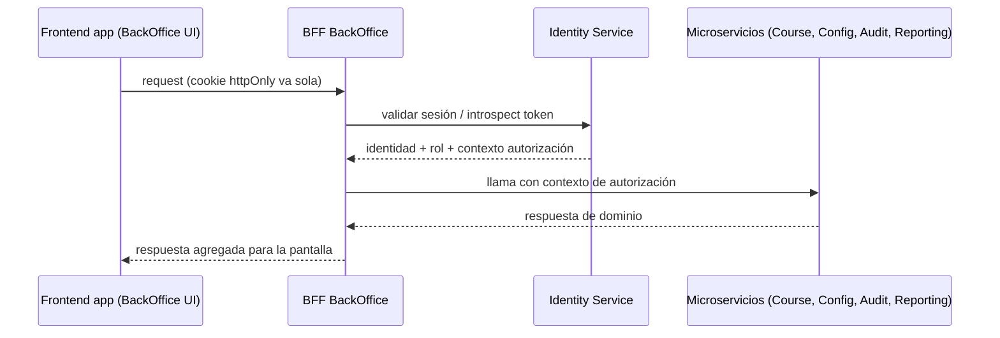

# Frontend — Plan de Comunicación (Caso A)

> **Postura confirmada:** Caso A (apps Angular SSR independientes en multirepos, integradas por Nginx).
> **Documento base:** `frontend_arquitectura_analisis.md` (investigación). Este documento es el **plan con decisiones concretas**.
> **Estado:** plan **definido** y alineado a la consigna de Front (Arquitectura y Despliegue U1). Para el BackOffice, la arquitectura y el despliegue están en §10 y en la página del sitio `frontend/arquitectura-despliegue`.

---

## 1. Decisiones base

| Decisión | Elección |
|---|---|
| Integración de apps | **Caso A** — apps Angular SSR por dominio en multirepos |
| BFF | **Uno por experiencia** (BackOffice, Alumno, Profesor) |
| Compartir estado entre apps | Custom Events + Storage (sin store global) |
| Sesión | Cookie httpOnly en dominio compartido; propiedad de Identity (BackOffice) |
| UI compartida | Librería `@tup/ui` (tokens + componentes) |
| Entrada pública | Nginx (reverse proxy + enrutador técnico) |

---

## 2. Comunicación frontend → BFF → microservicios

### 2.1 Decisión: BFF por experiencia

| Alternativa | Cuándo | Decisión |
|---|---|---|
| BFF compartido | Un solo equipo, pocas apps | ❌ Cuello de botella; acopla experiencias |
| BFF por dominio | Alineado con microservicios | ❌ El front termina llamando a muchos BFFs |
| **BFF por experiencia** | **BackOffice, Alumno, Profesor** | ✅ **Elegido** |

Cada experiencia agrega lo que su pantalla necesita y esconde la red de microservicios. En el Caso A, cada equipo es dueño del BFF de su app: el **BFF de BackOffice es del equipo BackOffice**.

### 2.2 Flujo



### 2.3 Responsabilidades del BFF

- Recibe la **cookie httpOnly** (no legible por JS) y la valida contra Identity.
- Convierte la sesión en **contexto de autorización** (usuario, rol, alcance).
- **Agrega** respuestas de varios microservicios para la pantalla.
- Oculta la red de microservicios al front.
- Sirve datos para el **SSR** (render inicial del servidor).
- **No** almacena reglas de negocio: solo orquesta y adapta contratos.

> **Autenticación BFF → microservicios (concepto):** el BFF no reenvía las credenciales del usuario al navegador; internamente usa un contexto de autorización (token de servicio + identidad del usuario) para que el microservicio valide rol y alcance. Detalles (formato del contexto, expiración) a definir en la coordinación/LL.

---

## 3. Compartir información entre frontends

### 3.1 Custom Events (catálogo conceptual)

Mecanismo preferido para avisos puntuales y desacoplados entre apps del mismo dominio (o pestañas).

| Evento (concepto) | Cuándo se dispara | Consumidores |
|---|---|---|
| `auth:logout` | El usuario cerró sesión en cualquier app | Todas las apps: limpian estado local y redirigen |
| `auth:session-expired` | El BFF devolvió 401 por sesión vencida | App activa: redirige a login conservando el intento |
| `data:changed` | Un dominio actualizó datos visibles en otra app (ej. XP) | Apps interesadas: refrescan |

Reglas:
- Payload mínimo y versionable; nombres/contratos a fijar en la coordinación.
- Son **notificaciones**, no la fuente de verdad del estado.

### 3.2 Storage

- `localStorage` / `sessionStorage` (mismo origen) para **preferencias y caché ligera** no sensibles.
- **Nunca** tokens ni datos sensibles (riesgo XSS): el token va en cookie httpOnly.

### 3.3 Store compartido

- **No** se usa store global entre apps distintas: es frágil y acopla. Cada app mantiene su NgRx/local state.
- **Regla:** el estado de negocio vive en el servidor; cada app lo consulta. Los eventos/storage solo notifican o cachean.

---

## 4. Cookies, sesión, login y logout

Mecánica **conceptual** (nombres/endpoints concretos a definir en la coordinación o Low Level Design).

- **Cookie httpOnly + Secure + SameSite**, con dominio compartido (`plataforma.edu.ar`) → viaja sola a todas las apps del Caso A.
- **Login único:** una sola pantalla/flujo de login (Identity). Emite el JWT en la cookie.
- **2FA:** obligatorio (RNF-02 del PRD); el flujo de segundo factor vive en Identity.
- **Logout:** endpoint de logout que invalida la sesión + borra la cookie + dispara `auth:logout`.
- **Expiración:** si el BFF devuelve 401 → la app redirige a login conservando la navegación intentada; se emite `auth:session-expired` para las otras pestañas.

> **Propiedad:** este contrato de sesión lo define el **equipo BackOffice** (Identity Service), porque es quien emite y valida la sesión. El front solo la consume.

---

## 5. Librería CSS/UI compartida

- **`@tup/ui`**: design tokens (variables CSS: color, spacing, tipografía, radios) + componentes (botones, tablas, forms, navbar, badges).
- Publicada como paquete npm **versionado (semver)**: breaking → major.
- Consumo **solo** desde la librería: no se definen estilos propios que rompan el token.
- **CI**: valida que la librería compile y que las apps usen versiones compatibles.

---

## 6. Nginx — entrada pública y enrutador técnico

| Ruta | Destino |
|---|---|
| `/` | App Alumno / landing (SSR) |
| `/profesor` | App Profesor (SSR) |
| `/backoffice` | App BackOffice (SSR) |
| `/api/*` | BFF / Gateway (proxy) |
| `/assets/*` | Estáticos de cada app |

Responsabilidades:
- Reverse proxy + **terminación TLS** (HTTPS).
- Servir el **HTML renderizado (SSR)** y los assets por prefijo.
- Compresión, cache de assets inmutables, **headers de seguridad** (CSP, HSTS).
- **Degradación controlada:** si una app está caída, página de aviso sin romper al resto.

---

## 6bis. Recarga de página y deep-links (evitar corromper el SPA)

Al recargar una **ruta client-side** (ej. `/backoffice/cursos/10`), el navegador le pide esa URL a Nginx, que no tiene un archivo así. Si el fallback está mal configurado, sirve el index de **otra app** (o un 404) → el SPA se "corrompe" (pantalla en blanco o app equivocada). Solución en capas:

### 6bis.1 Nginx: fallback por prefijo

Cada app tiene su propio `location` con fallback a **su** entrada:

```nginx
# SSR: delega al servidor Node de la app BackOffice
location /backoffice/ {
    proxy_pass http://backoffice-ssr:4000;
}

# (lo mismo para /profesor y /)

# API → BFF/Gateway
location /api/ {
    proxy_pass http://bff-gateway:8080;
}
```

Respaldo estático (sin SSR o como fallback):
```nginx
location /backoffice/ {
    try_files $uri $uri/ /backoffice/index.html;
}
```

> Regla de oro: el fallback apunta al index **de esa app**, nunca al de otra. El router de Angular retoma la ruta del deep-link tras el primer carga.

### 6bis.2 Cache headers (evita "chunks rotos" en recargas)

Un navegador con un `index.html` viejo referencia chunks con hash viejo; al recargar, pide un chunk que ya no existe → error de carga del módulo. Regla:

- `index.html` (o el HTML del SSR): **`Cache-Control: no-cache`** (siempre revalidar).
- Assets con hash (`.js`/`.css`): **`immutable` + cache largo**.

### 6bis.3 SSR: hidratación consistente

En Angular SSR, el HTML inicial lo genera el servidor y luego hidrata el navegador. Si server y client difieren → *hydration mismatch*:

- Los datos iniciales vienen del **BFF** (misma fuente en server y client).
- Evitar render no-determinista (fechas, random, ids generados en el template).

### 6bis.4 Chunk load error → hard reload

Si un usuario con una pestaña vieja recarga y falla un chunk dinámico, Angular detecta el error de import dinámico y hace **hard reload** para forzar el index nuevo.

### 6bis.5 Estado tras la recarga

Al recargar se pierde el estado en memoria (NgRx) — **esperado** en Caso A: el servidor es la fuente de verdad; la app re-bootstrapa y vuelve a pedir datos por el BFF. Los Custom Events entre apps no persisten; nada crítico vive solo en memoria del front.

---

## 7. Marketplace de plugins para la TUP orientado a agentes de IA

> Diseño **conceptual** (feature futura; fuera del MVP). Agentes objetivo: Claude, Codex, OpenCode, Gemini, Copilot.

### 7.1 Capacidades

| Capacidad | Qué implica |
|---|---|
| **Publicar** | Manifesto (id, nombre, versión, autor, descripción, tags, permisos declarados), SDK del agente al que apunta |
| **Versionar** | Semver; versiones **inmutables**; canales stable/beta |
| **Descubrir** | Catálogo con búsqueda por agente/capacidad/rating; trust score |
| **Instalar/actualizar** | Resolución de dependencias, compatibilidad con la versión del agente, **rollback**, control de actualizaciones |
| **Validar** | Análisis estático, sandbox de ejecución, validación del esquema de **tools (MCP)**, firma + checksums |

### 7.2 Seguridad

- **Least privilege:** el plugin declara permisos; el usuario aprueba explícitamente antes de ejecutar acciones.
- **Supply-chain:** artefactos firmados, checksums, proveniencia.
- **Sandbox** de ejecución y análisis de código (scan de secretos, anti-malware).
- **Cuotas / rate limits** por plugin y por usuario.
- **Auditoría** de instalación y ejecución.

### 7.3 Agentes de IA y MCP

El plugin expone un **contrato de herramientas (tools)** — idealmente **MCP (Model Context Protocol)** — que el agente invoca con entradas/salidas tipadas. El marketplace valida ese esquema y el **set de permisos** antes de que el usuario confirme.

---

## 8. Peticiones duplicadas y manejo de 429

Objetivo: cuando el usuario dispara **múltiples peticiones iguales**, solo se ejecuta **UNA** hasta que complete; y el front/back tratan correctamente el error **429 Too Many Requests**.

### 8.1 Frontend — patrón single-flight (request dedup)

En el **interceptor HTTP** del cliente:

```text
Petición (método + URL + body)
        │
        ▼
¿Existe una petición idéntica EN VUELO?
   ├── Sí → unirse a la misma promesa (no disparar otra)
   └── No → disparar; al completar, liberar la clave
```

- **Clave de dedup:** `método + URL + body normalizado` (o `Idempotency-Key` si el backend la soporta).
- Beneficio: doble click en "Crear curso", "Guardar configuración", "Importar padrón", etc. → **una sola petición**.
- Complemento **UX**: botones deshabilitados / estados de carga mientras la petición está en vuelo (el interceptor es la garantía real, la UI es solo refuerzo).

### 8.2 Frontend — manejo de 429

- En el interceptor, ante **429**: leer el header **`Retry-After`** y esperar ese tiempo (backoff con jitter) antes de reintentar.
- **No** reintentar automáticamente operaciones no idempotentes (POST/PUT administrativos).
- Mostrar al usuario un mensaje claro: "Demasiadas solicitudes, esperá unos segundos".
- El **BFF** puede coalescer peticiones idénticas como segunda barrera (dedup server-side).

### 8.3 Backend — rate limiting y 429

- **Rate limiting en el Gateway** (Spring Cloud Gateway): token bucket con **Bucket4j** (in-memory, por instancia) o **Redis RequestRateLimiter** (distribuido, si hay varias instancias).
- Umbrales por **endpoint y rol**; especial atención a `/login`, `/api/auth/*`, `/api/audit` y operaciones administrativas pesadas.
- Respuesta **429** con header **`Retry-After`** y el formato de error uniforme.
- **Idempotency Keys** en operaciones administrativas críticas (PUT de configuración, baja de ADMIN): el backend detecta el duplicado y responde con el resultado original (red de seguridad server-side, además del dedup del front).

---

## 9. Resumen de decisiones

```text
Caso A (Nginx) + BFF por experiencia + Custom Events/Storage
+ Cookie httpOnly compartida (propiedad de Identity)
+ @tup/ui + single-flight + rate limiting en Gateway
+ Marketplace de plugins con MCP y permisos explícitos
```

> **Próximos pasos:** fijar los contratos concretos (nombres de eventos, endpoints de sesión, formato del contexto BFF→servicios) en la coordinación con los demás equipos.

---

## 10. Arquitectura y despliegue (consigna Front — Unidad 1)

> Detalle completo: página del sitio `frontend/arquitectura-despliegue` y `sdd/frontend/docs/09-despliegue.md`.

**Componentes (BackOffice, materia Front):** app Angular SSR (`backoffice-ssr`) · Nginx de plataforma · **BFF BackOffice** (`bff-backoffice`). No suman microservicios de dominio (el backend sigue con 2 servicios propietarios).

**Nginx roles:** servidor web (estáticos/SSR) + reverse proxy (`/api/*` → BFF) + deep-links (`try_files $uri $uri/ /backoffice/index.html`) + headers de seguridad.

**Conexiones:** `Front → BFF → API Gateway (T01) → Administration / Reporting / T02 / lecturas`. El front no habla con Kafka ni con la base. Multitenancy resuelto por el BFF (alcance curso puntual o `ALL`).

**Build/despliegue:**
- Docker **2 etapas** (`node:20` compila → `nginx:alpine` sirve); **`envsubst`** para `${BFF_URL}` (misma imagen staging/producción).
- **Load balancing** con `upstream`: algoritmos de Nginx — **Round Robin** (por defecto) · **Weighted** (`weight=3`) · **Least Connections** (`least_conn`, carga despareja) · **IP Hash** (`ip_hash`, sticky sessions). Para el TP (~450 usuarios, mitad activos) alcanza **1 instancia**.
- **Estrategias evaluadas:** **Rolling Update + Feature Flags** (base) · **Blue-Green** (alternativa, cero downtime) · Canary, A/B y Shadow **descartados** (exigen balanceo por porcentaje/monitoreo en tiempo real o duplicar tráfico sin duplicar efectos — no justificados en el TP).
- **Herramientas:** **CI/CD GitHub Actions** (build 2 etapas → tests → push imagen → deploy compose) · **Secretos** con variables de entorno (`envsubst`, nunca credenciales en el repo) · **Inmutabilidad** con imagen por release (Docker Compose; Terraform/Ansible si sobra tiempo) · **Monitoreo/rollback** con healthchecks `service_healthy`, logs de Nginx y tags por versión (Prometheus/Grafana opcional).