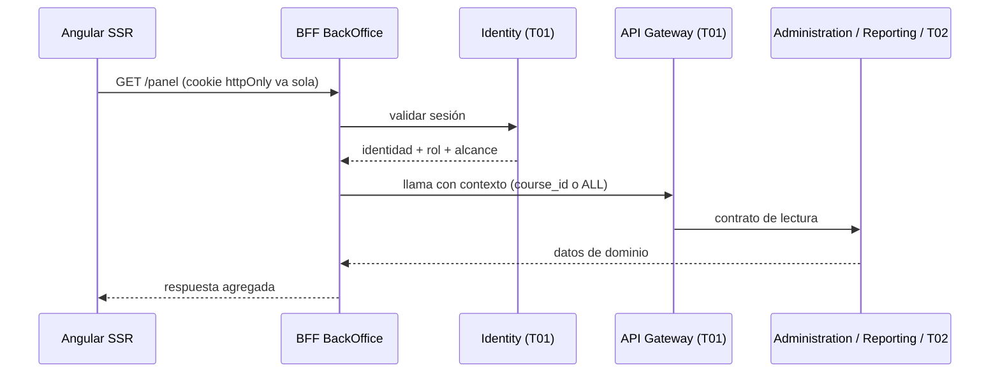

# Tarea F1 — BFF BackOffice

> **Sprint 1 · Talla M · ~4 persona-días** · Patrón Backend for Frontend (consigna Front U1)

## 1. Objetivo
Crear el **BFF del BackOffice** (del equipo BackOffice): recibe la cookie httpOnly, valida la sesión en **Identity (T01)**, arma el contexto de autorización (usuario/rol/alcance) y **agrega** las respuestas de los microservicios para cada pantalla. Sirve datos al **SSR**.

## 2. Alcance
- **In:** orquestación de contratos, adaptación de respuestas por pantalla, manejo de sesión, contexto de tenant.
- **Out:** NO contiene reglas de negocio (solo orquesta); NO habla con la base ni con Kafka.

## 3. Requerimientos vinculados
RF-CFG-* (lectura de PAR para la UI), RF-RPT-* (panel/reportes), RF-AUD-* (auditoría de acciones admin).

## 4. Diseño técnico
- **Arquitectura:** servicio server-side (materia Front), Node/NestJS o Java según decisión del equipo; **no es un microservicio de dominio** del BackOffice (el backend sigue con 2 servicios).
- **Flujo:** cookie → `Identity/validate` → contexto (usuario, rol, alcance curso/ALL) → llama a los servicios vía **API Gateway (T01)** → responde agregado.
- **Multitenancy:** el BFF resuelve el **selector de alcance** (curso puntual o `ALL`) y lo pasa como contexto validado; el front **nunca** manda `course_id` suelto.
- **Endpoints propios** por pantalla: `/panel`, `/reportes`, `/config`, `/proveedor-llm`.

## 5. Pruebas
Validación de sesión (cookie), autorización por rol/alcance (PROFESOR → solo su curso; ADMIN → ALL), agregación correcta, 401 → login.

## 6. DoD
- [ ] Sesión validada contra Identity; contexto de autorización armado.
- [ ] Endpoints por pantalla con respuesta agregada.
- [ ] Alcance multitenancy resuelto por el BFF (nunca del request).
- [ ] Sin reglas de negocio; contrato OpenAPI.

> Reglas: `rules/RULES-stack.md` · `docs/02-bff.md` · `docs/09-despliegue.md`.