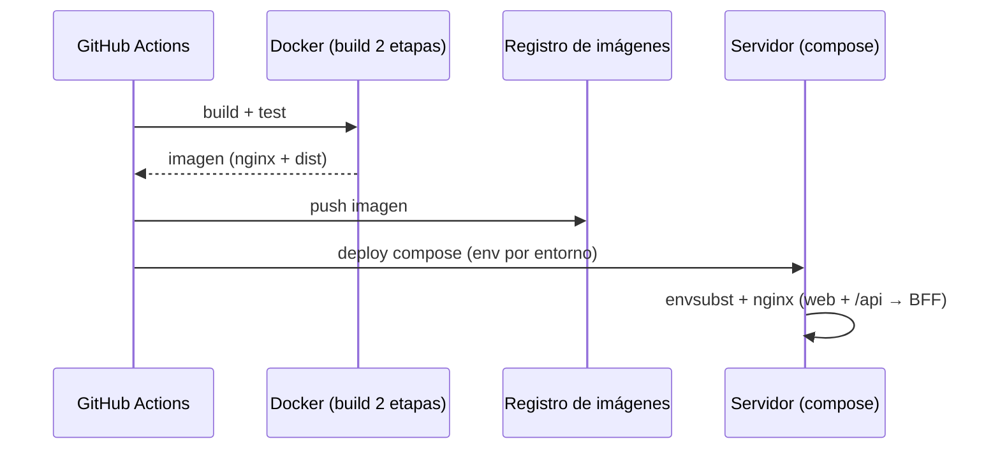

# Tarea F5 — Despliegue (Docker 2 etapas + Nginx + compose + CI)

> **Sprint 3 · Talla M · ~3 persona-días** · Consigna Front U1 (Nginx + despliegue)

## 1. Objetivo
Desplegar el frontend del BackOffice: **build Docker en 2 etapas** (`node:20` compila → `nginx:alpine` sirve), **Nginx** (web server + reverse proxy `/api/*` → BFF + deep-links), **`envsubst`** para config dinámica y **docker-compose** con el BFF.

## 2. Alcance
- **In:** Dockerfile 2 etapas, `nginx.conf.template`, compose, healthchecks, CI/CD (GitHub Actions), estrategia de despliegue.
- **Out:** no despliega el backend (eso es de la materia Back).

## 3. Requerimientos vinculados
Consigna Front U1 (arquitectura y despliegue): Nginx, reverse proxy, BFF, load balancing, estrategias de release.

## 4. Diseño técnico
- **Dockerfile:** `FROM node:20 AS build` → `npm install && npm run build` → `FROM nginx:alpine` → copia `dist/` y `nginx.conf.template`.
- **Config dinámica:** `envsubst < template > default.conf` al arrancar; `${BFF_URL}` por entorno → **misma imagen para staging/producción**.
- **Nginx:** `/backoffice/` → SSR; `/backoffice/` → `try_files ... /backoffice/index.html` (deep-links); `/api/` → BFF; cache de assets inmutables; headers de seguridad.
- **compose:** `frontend-backoffice` (puerto 8080:80 visible) + `bff-backoffice` (expose interno 4100) con `healthcheck`; `depends_on` con `condition: service_healthy`.
- **Load balancing:** `upstream` documentado para escalar (para el TP 1 instancia).
- **CI/CD:** GitHub Actions — build 2 etapas → tests → push imagen → deploy del compose.

## 5. Despliegue (estrategia)
- **Base:** **Rolling Update** (reemplazo gradual) + **Feature Flags** para activar pantallas sin re-deploy.
- **Alternativa:** **Blue-Green** si la cátedra exige cero downtime (Nginx cambia de entorno).
- **Monitoreo/rollback:** healthchecks, logs de Nginx, tags por versión.

## 6. DoD
- [ ] Imagen lista para producción (sin Node en la imagen final).
- [ ] `envsubst` resuelve `${BFF_URL}` en staging y producción (sin re-build).
- [ ] Deep-link `/backoffice/...` carga el index de BackOffice; `/api/` llega al BFF.
- [ ] CI/CD verde + healthchecks con `service_healthy`.

> Reglas: `rules/RULES-stack.md` · `skills/SKILL-nginx.md` · `docs/09-despliegue.md`.