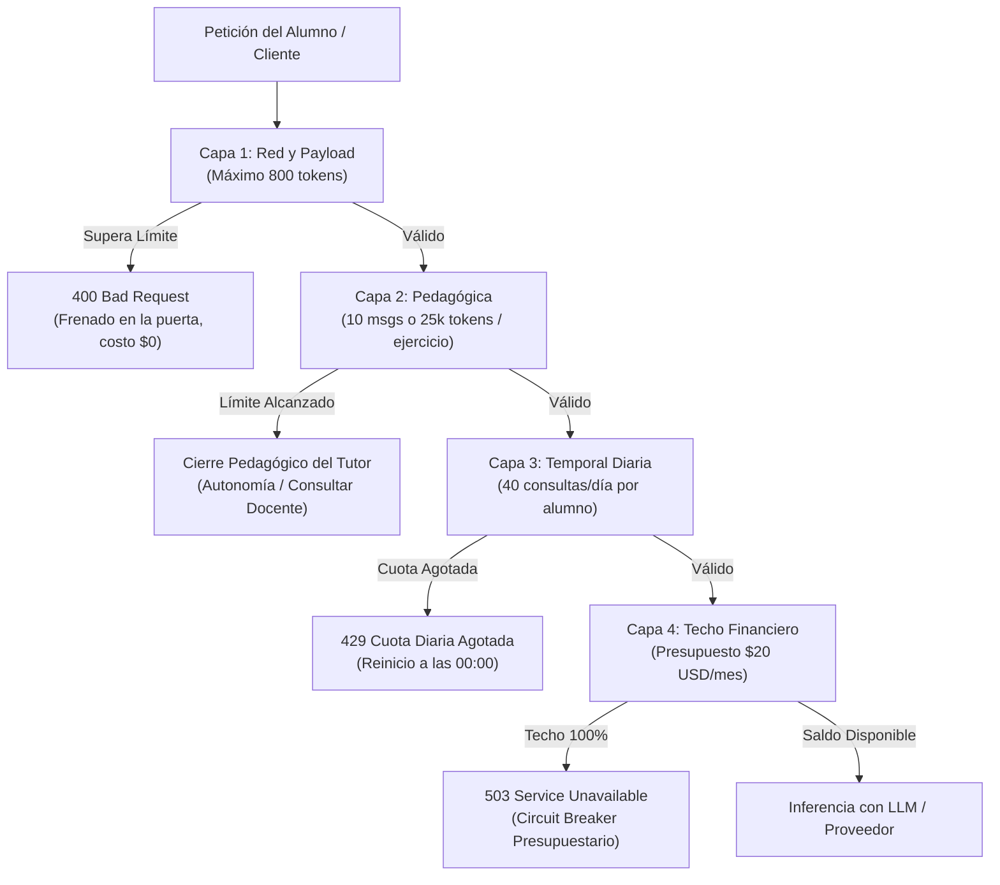

# Explicación de Límites y Uso

> **Destinatario:** Microservicio de Backoffice / ADMIN (Tema 12)  
> **Emisor:** Microservicio `llm-service` (Tema 07 — Inteligencia Artificial)  
> **Estado:** Vigente / Documento de Referencia Inter-Equipos

---

## 1. Propósito y Principios Rectores

En `llm-service`, los límites no son simples trabas técnicas: son **mecanismos de defensa y cuidado pedagógico**. Están diseñados para cumplir tres reglas fundamentales:

1. **Cero Facturas Sorpresa (*Anti Denial-of-Wallet*):** Ningún alumno, script o bucle accidental puede vaciar el presupuesto de la cátedra.
2. **Presupuesto Cerrado y Fijo:** La cátedra tiene un techo inflexible de **USD 20,00 por mes** para los 180 alumnos (~USD 0,11 por alumno al mes).
3. **Cuidado Pedagógico:** La IA no está para resolverle la tarea al alumno, sino para guiarlo con preguntas socráticas y empujarlo a que programe por su cuenta.



---

## 2. Taxonomía de Límites en 4 Capas

Para que sea fácil de entender y configurar desde Backoffice, los límites están divididos en 4 capas bien diferenciadas:

| Capa | Nombre del Límite | ¿Qué limita en palabras simples? | Regla / Parámetro Fijo | ¿Qué pasa si el alumno se pasa? |
| :--- | :--- | :--- | :--- | :--- |
| **Capa 1** | **Por Mensaje (Red)** | **Que no manden textos larguísimos.** Evita que peguen un archivo gigante de código entero de 2.000 líneas o prompts interminables. | • Máximo **800 tokens** por mensaje (aprox. 1 o 2 párrafos de código). | El servidor frena la petición en seco en la puerta (`400 Bad Request`). La IA ni se entera y **se gastan 0 tokens ($0,00)**. |
| **Capa 2** | **Por Ejercicio (Pedagógica)** | **Que no usen la IA para que les resuelva todo el trabajo.** Evita que un estudiante se quede horas preguntando hasta que el tutor le termine dando la solución servida. | • Máximo **10 mensajes** en el mismo ejercicio.<br>• Máximo **25.000 tokens** acumulados en ese hilo.<br>*(Lo que ocurra primero)* | El tutor corta amablemente la ayuda: le explica que ya le dio suficientes pistas y lo invita a pensar por su cuenta o llevar la duda a la clase de consulta con el docente. |
| **Capa 3** | **Cuota Diaria (Por Alumno)** | **Que nadie se gaste todas las consultas del día.** Reparte las preguntas equitativamente para que un solo alumno no monopolice el servicio y deje sin cupo al resto de la clase. | • **40 consultas por día** al tutor.<br>• **3 desafíos prácticos por día** para generar. | El sistema le avisa que llegó a su tope diario y que se le vuelve a habilitar a medianoche (00:00). Lo que no gasta no se acumula. |
| **Capa 4** | **Techo de Presupuesto (Financiera)** | **La plata total que gasta la cátedra en el mes.** Evita cualquier desborde de costos para que a fin de mes no llegue una factura impagable a la facultad. | • Techo estricto de **USD 20,00 por mes** para los 180 alumnos de la cohorte. | Funciona con un semáforo de 3 niveles:<br>• **70% ($14,00):** Manda alerta a Backoffice.<br>• **90% ($18,00):** Entra en modo ahorro (recorta contexto).<br>• **100% ($20,00):** Corta las llamadas pagas para no pasarse jamás de los $20. |

### ¿Por qué NO usamos un límite semanal? (Explicado simple)

En lugar de darle al estudiante una "bolsa semanal" de preguntas (por ejemplo, 200 consultas a la semana), elegimos un **límite diario (40 por día)** por tres razones pedagógicas y operativas:

1. **Evita que el alumno "se quede a pie" toda la semana:**  
   Si la cuota fuera semanal, un estudiante frustrado con un bug un lunes o martes podría gastarse todas sus preguntas en una sola tarde. Como resultado, **se quedaría sin tutor de IA durante los 5 o 6 días restantes**, justo cuando más lo necesita para terminar el trabajo práctico el fin de semana.
2. **Fomenta el hábito de estudio diario y da revancha al día siguiente:**  
   Con el límite diario, si hoy tuviste un día difícil y gastaste tus 40 consultas, **esta noche a las 00:00 tenés la cuenta limpia de nuevo**. Podés descansar, despejar la cabeza y volver a intentar programar mañana sin arrastrar un castigo de días.
3. **Cero reclamos administrativos en Backoffice:**  
   Las cuotas semanales generan una avalancha constante de mensajes a los profesores y administradores (*"profe, me quedé sin cuota el miércoles y entrego el viernes, ¿me la resetea?"*). El reseteo diario a medianoche es automático, equitativo y no exige intervención manual de nadie en Backoffice.

---

### ¿Y si en un parcial 180 alumnos tienen que usar el tutor en simultáneo? ¿Se mantienen estos números?

#### 1. En lo Económico: ¿Cuánto cuesta ese parcial?

Durante un examen, ningún alumno puede preguntar infinitamente gracias a los límites de **Capa 2 (máximo 10 mensajes por ejercicio)**:

* **Volumen de consultas del parcial:**  
  Si los 180 alumnos llegan al examen y todos agotan el 100% de sus 10 consultas con el tutor:  
  $$180 \text{ alumnos} \times 10 \text{ consultas} = \mathbf{1.800 \text{ consultas totales}}$$
* **Costo real con Gemini Flash-Lite + Prompt Caching:**  
  Cada consulta cuesta **\$0,00036 USD**.  
  $$1.800 \times \$0,00036 = \mathbf{USD\ 0,65}$$
* **Conclusión económica:**  
  Un parcial completo con 180 alumnos exprimiendo al tutor cuesta **apenas 65 centavos de dólar**.  
  Esto representa solo el **4,6%** de los **USD 14,00** que tiene asignados el tutor para todo el mes. Incluso si el parcial tuviera 2 ejercicios y preguntaran 20 veces cada uno, costaría **\$1,30 USD** (menos del 10% del presupuesto).

#### 2. En lo Técnico: ¿Aguantan los servidores y la API al mismo tiempo?

En un parcial de 2 horas (120 minutos):

* **La simultaneidad real (~45 concurrentes):**  
  Los 180 alumnos no hacen click en "Enviar" al mismo milisegundo. En un examen están leyendo la consigna, tipeando en su IDE o depurando tests. Como máximo, un **25%** tiene una consulta en vuelo en un instante dado (**~45 llamadas simultáneas**).
* **Tráfico en RPM (Peticiones por minuto):**  
  1.800 consultas repartidas en 120 minutos dan un promedio de **15 a 20 consultas por minuto**, con picos iniciales de **~225 RPM**.
* **El requisito clave (Tier 1 vs Free Tier):**  
  * ❌ **En Free Tier de Google:** Colapsaría en 2 minutos. El Free Tier tiene un límite estricto de **15 RPM**.  
  * ✅ **En Cuenta Paga (Tier 1):** Google otorga entre **1.000 y 4.000 RPM** de base. Las 225 RPM del parcial ocupan menos del 25% de la capacidad de la cuenta paga.

---

## 3. Distribución Presupuestaria de los USD 20,00 / Mes

El presupuesto mensual está repartido de forma fija entre las distintas tareas del microservicio:

```
┌────────────────────────────────────────────────────────────────────────┐
│ PRESUPUESTO MENSUAL TOTAL: USD 20,00 / MES (180 Alumnos)               │
├──────────────────────────┬───────────────────┬─────────────────────────┤
│ Funcionalidad            │ Modelo Asignado   │ Presupuesto / Capacidad │
├──────────────────────────┼───────────────────┼─────────────────────────┤
│ 1. Tutor Socrático       │ Gemini Flash-Lite │ USD 14,00 / mes         │
│    (Tiempo real, chat)   │ + Prompt Caching  │ (~38.800 consultas/mes) │
├──────────────────────────┼───────────────────┼─────────────────────────┤
│ 2. Evaluador de Código   │ Claude Haiku 4.5  │ USD 3,50 / mes          │
│    (Rúbrica BARS 5D)     │ Batch API (-50%)  │ (~670 entregas/mes)     │
├──────────────────────────┼───────────────────┼─────────────────────────┤
│ 3. Generador de Desafíos │ Gemini Flash-Lite │ USD 2,50 / mes          │
│    (JSON estructurado)   │ Batch API (-50%)  │ (~3.200 retos/mes)      │
├──────────────────────────┼───────────────────┼─────────────────────────┤
│ 4. Moderador de Chat     │ Pool Round Robin  │ USD 0,00 / mes          │
│    (Convivencia alumnos) │ (⚠️ MODELO A PROBAR)│ (> 350 req/min gratis) │
├──────────────────────────┼───────────────────┼─────────────────────────┤
│ 5. RAG Teórico           │ PostgreSQL 16     │ USD 0,00 / mes          │
│    (Apuntes de cátedra)  │ pgvector + CPU    │ (Sin costos cloud)      │
└──────────────────────────┴───────────────────┴─────────────────────────┘
```

> [!WARNING]
> **⚠️ Moderación de Chat — Modelo asignado pendiente de pruebas (sujeto a cambios):**  
> Para la moderación del chat de convivencia entre estudiantes se diseñó una estrategia de **Round Robin circular** entre 4 clasificadores cloud gratuitos (*OpenAI omni-moderation, Groq Llama-Guard 3, Google Perspective API y RoBERTuito*). Sin embargo, **el modelo asignado todavía hay que probarlo** en el banco de pruebas de la cátedra para validar latencias reales, precisión en modismos locales y comportamiento bajo ráfagas antes de darlo por definitivo. Por esta razón, todo este esquema se encuentra **sujeto a cambios** en función de los resultados que arrojen las evaluaciones.

> [!IMPORTANT]
> **Ahorro con Batch API:** Las tareas de Evaluación de entregas y Generación de Desafíos no se procesan en tiempo real mientras el alumno espera frente a la pantalla, sino de forma asíncrona mediante la **Batch API** con colas en PostgreSQL (`SKIP LOCKED`), lo que otorga un **50% de descuento automático en todos los tokens**.

