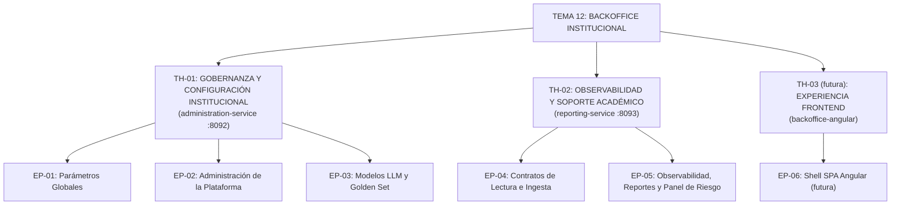

# Sprint 0 — BackOffice (Tema 12)

> **Entregable:** un único PDF por grupo (Propuesta de Sprint 0 + DoD + capacidad + épicas + historias de usuario). Este `.md` es la **fuente** desde la que se genera el PDF.

## 1. Propuesta de Sprint 0

### 1.1 Objetivo
Preparar las **bases de trabajo** del equipo para todo el proyecto: repositorios, entorno, estándares, contratos y backlog inicial. **No se implementan funcionalidades** en este sprint; sí se deja todo listo para que el Sprint 1 arranque con el **backend funcional** y un flujo demostrable.

### 1.2 Bases de trabajo (normas del equipo)
- **Tecnologías**: Java 21 + Spring Boot 3 + Maven · PostgreSQL · **Kafka** (Outbox + idempotencia + caché TTL) · Eureka + Config Server · API Gateway de plataforma (T01) · GitHub Actions (CI) · Testcontainers · OpenAPI/Swagger.
- **Git y revisión**: ramas `feature/*` + **Pull Request con revisión de ≥1 compañero** · mensajes convencionales (`feat:`, `fix:`, `docs:`) · `main` protegido (nada se mergea sin PR).
- **Calidad**: build Maven verde · **Clean Architecture** (sin reglas de negocio en controllers) · tests unitarios + integración (Testcontainers) · **sin secretos en el repo** (config por variables/`envsubst`).
- **Documentación**: `sdd/` + sitio **sincronizados** ante cualquier cambio · trazabilidad **`RF-XXX`**.
- **Contratos**: envelope de eventos estándar y naming de topics **acordados con los demás equipos** (T01/03/05/08/10) antes de implementar consumos.
- **Seguimiento**: todo el trabajo en **Taiga** (épicas → historias → tareas) · comunicación por el canal del equipo · revisión periódica del avance.

### 1.3 Tareas iniciales del Sprint 0
1. **Repos y git**: estructura confirmada en `Backoffice-TPI`, protección de `main`, CI (GitHub Actions) verde desde el arranque.
2. **Bootstrap de los 2 servicios**: `administration-service` y `reporting-service` (Spring Boot, PostgreSQL, Flyway, perfiles por entorno).
3. **Entorno compartido**: `docker-compose` completo (Kafka, PostgreSQL, Eureka, Config Server, Gateway simulado de T01).
4. **Contrato de eventos**: envelope estándar + topics (`administration.events`, etc.) coordinado con los equipos consumidores.
5. **DoD**: definirla (sección 2 de este documento) y cargarla en Taiga.
6. **Backlog en Taiga**: cargar épicas y primeras historias de usuario.
7. **Planificación del Sprint 1**: seleccionar historias según la **capacidad efectiva** del equipo (sección 3).

### 1.4 Resultado esperado del Sprint 0
Repos y entorno levantados · DoD definida · backlog inicial en Taiga · contrato de eventos acordado · **Sprint 1 planificado** con las historias que la capacidad permite.

## 2. Definition of Done (DoD)

> **Sobre la adaptación:** esta DoD no es una definición genérica. Cada condición se ancla a la **tecnología** del proyecto (Java/Spring, PostgreSQL, Kafka, RLS, OpenAPI), a nuestros **controles de calidad** (Testcontainers, Outbox + idempotencia, revisión de PR) y a nuestras **entregas** (`sdd/` + sitio sincronizados, Taiga, trazabilidad `RF-XXX`). Sigue la estructura profesional en niveles (tarea · historia · sprint · release).

**Aplicación:** una **tarea**, **historia de usuario**, **sprint** o **release** está *terminada* cuando cumple todas las condiciones de su nivel (y los niveles inferiores).

### Nivel 0 · Tarea
- Cumple sus **criterios de aceptación propios** (los definidos por tarea en `sdd/`).
- **Build verde** (`mvn clean verify`) · tests de la tarea pasando.
- **Cobertura de tests ≥ 90%** (objetivo: se intenta lograr siempre en lo posible).
- Una tarea se cierra solo cuando su **historia** también alcanza el **Nivel 1**.

### Nivel 1 · Historia de Usuario
- Cumple el **requisito citado (`RF-XXX`)** y sus **criterios de aceptación**.
- **Build verde** (`mvn clean verify`) · sin warnings críticos · **Clean Architecture** (sin reglas de negocio en controllers).
- **Tests** unitarios de dominio/casos de uso + **integración con Testcontainers** (PostgreSQL + Kafka) donde publique/consuma eventos.
- **Cobertura de tests ≥ 90%** (objetivo: se intenta lograr siempre en lo posible).
- **Outbox + idempotencia** verificados (por `event_id` y `version`).
- **Autorización por rol** probada (ADMIN/PROFESOR → 200/403).
- **Alcance multitenancy** verificado: RLS filtra por `course_id`; `ALL` solo ADMIN y auditado.
- **Contrato OpenAPI/eventos** documentado y coordinado con consumidores.
- **PR revisada por ≥1 compañero** · sin secretos en el repo.
- **`sdd/` + sitio sincronizados**.

### Nivel 2 · Sprint
- **Todas sus historias cumplen el Nivel 1**.
- **Sin regresiones**: suite completa verde al cierre.
- **Taiga actualizado** (estados correctos · capacidad respetada).
- **Revisión/demo del sprint lista** (flujo demostrable).
- **Retrospectiva realizada** y próximas acciones registradas.

### Nivel 3 · Release
- **`main` con CI verde** y **tag/versión**.
- **Desplegable**: imagen/entorno listo (Docker Compose, `envsubst`, sin Node en producción).
- **Contratos estables** y coordinados con los demás equipos (eventos + API).
- **Documentación de la release** alineada (sitio + `sdd/`).

> El frontend (app Angular + BFF) se agregará como bloque propio cuando lo definamos; por ahora la DoD cubre el **backend funcional**.

---

## 3. Capacidad del equipo

_Pendiente de completar._ El equipo está cargando el **Excel de 2 hojas** (`CAPACIDAD_SPRINT` + `RESUMEN`). Fórmula de referencia:

```
Capacidad efectiva = ((Días del Sprint − Ausencias) × Horas por día − Otras actividades) × % de dedicación
```

Los valores finales se incorporan en esta sección y en la **justificación del Sprint 1** (ver matriz de trazabilidad, sección 5).

---

## 4. Jerarquía de Producto y Temas Estratégicos

En metodologías ágiles (Scrum / SAFe), el backlog se estructura en niveles de abstracción:

```
Tema Estratégico → Épica → Historia de Usuario → Tarea Técnica
```

Para el **Tema 12 (Backoffice Institucional)** se definen **2 temas estratégicos de negocio** (+ 1 futura de frontend):



### Definición de los temas estratégicos

**TH-01 · Gobernanza y Configuración Institucional** — *quién tiene poder de actuar sobre la plataforma y bajo qué reglas*: humanos con rol **ADMIN** (EP-01/02) y **modelos de IA habilitados** (EP-03). Todas **escriben/deciden**, no solo muestran.
- Servicio responsable: `administration-service` (puerto 8092) · Épicas: EP-01, EP-02, EP-03.

**TH-02 · Observabilidad y Soporte Académico** — *la que muestra información en vez de gobernarla*: el **PROFESOR** solo consulta (no configura nada) y el **ADMIN** ve el consolidado.
- Servicio responsable: `reporting-service` (puerto 8093) · Épicas: EP-04 (habilitador de ingesta), EP-05.

**TH-03 · Experiencia de Usuario (futura)** — SPA Angular para los perfiles administrativo y docente (Caso A de cátedra: Angular SSR + Nginx + BFF).
- Componente responsable: `backoffice-angular` · Épica: EP-06 (futura).

---

## 5. Matriz de Trazabilidad y Backlog Priorizado

| Tema | Épica | Historia | Título | Rol | SP | Prioridad | Sprint |
|---|---|---|---|---|---|---|---|
| TH-01 | EP-01 | **US-01** | Modificación y versionado hacia adelante de parámetros globales (PAR-01..24) | ADMIN | 5 | Must | Sprint 1 |
| TH-01 | EP-01 | **US-02** | Publicación Outbox y caché TTL para consumidores (Temas 03/05/08/10) | Consumidores | 5 | Must | Sprint 1 |
| TH-01 | EP-02 | **US-03** | Asignación y revocación de rol ADMIN con salvaguarda cero-admin | ADMIN | 5 | Must | Sprint 1 |
| TH-01 | EP-03 | **US-04** | Registro, sustitución y conmutación segura de proveedores LLM | ADMIN | 5 | Must | Sprint 1 |
| TH-01 | EP-03 | **US-05** | Homologación golden set, calibración PAR-14 y fallback por deriva | ADMIN / Sistema | 8 | Must | Sprint 1 |
| TH-02 | EP-04 | **US-06** | Ingesta EDA idempotente y monitoreo de frescura (15 min) | Reporting / Sistema | 8 | Must | Sprint 1 |
| TH-02 | EP-05 | **US-07** | Panel docente de curso-cohorte, semáforo de riesgo y alerta | PROFESOR | 8 | Should | Sprint 2 |
| TH-02 | EP-05 | **US-08** | Tablero consolidado de KPIs con bloqueo de anonimato y alertas de desvío | ADMIN | 8 | Should | Sprint 2 |
| TH-02 | EP-05 | **US-09** | Exportación asíncrona de reportes (PDF/CSV) | ADMIN / PROFESOR | 5 | Could | Sprint 3 |

> **Calibración Sprint 1 (Must):** `5+5+5+5+8+8 = 36 SP`. La **capacidad efectiva** (sección 3) definirá cuántas historias se toman en el Sprint 1.

---

## 6. Especificación Detallada de Épicas e Historias de Usuario

Cada historia incluye: descripción (Como/Quiero/Para), reglas de negocio, criterios de aceptación (CA), escenarios BDD (Gherkin), endpoints y estimación.

### 6.1 Épica EP-01 · Parámetros Globales (PAR-01..24)

**Objetivo:** centralizar, versionar y gobernar los parámetros de economía y operativos de la plataforma, garantizando que cada cambio rija **hacia adelante** y se propague por **Outbox → Kafka** a los consumidores (Temas 03/05/08/10).

**Suposiciones:** el PRD define PAR-01..18; el catálogo es **extensible** hasta PAR-24 (candidatos deducidos a validar con la cátedra). Los consumidores mantienen **caché con TTL 10 min**.

**Restricciones:** solo ADMIN modifica (RF-CFG-04) · PROFESOR solo lectura sin metadatos de autoría (RF-CFG-05) · **no retroactividad** (RF-CFG-06) · `Idempotency-Key` obligatorio en PUT.

**Criterios de aceptación épicos:** modificación versionada (`v1→v2`) persistida junto al `OutboxMessage` · consulta diferenciada ADMIN/PROFESOR · despacho garantizado a Kafka.

**Dependencias / Impactos:** `administration-service` · Kafka · equipos T03/05/08/10 · tablas `system_parameters`, `outbox_events`.

#### US-01 · Modificación y versionado hacia adelante de parámetros globales
- **Como:** ADMIN · **Quiero:** modificar PAR-01..24 con valor, vigencia y justificación · **Para:** ajustar la economía sin desplegar código y respetando la no-retroactividad.
- **Reglas de negocio:** solo ADMIN · incremento de `version` + fila en `outbox_events` + `parameter_audit_history` · validación de rango por PAR (ej. PAR-19 [0..100%]) · `effective_from` no puede ser pasado · idempotencia por `Idempotency-Key`.
- **Criterios de aceptación:**
  - **CA1:** PUT válido → `200` + versión incrementada + outbox creado.
  - **CA2:** reintento con la misma `Idempotency-Key` → mismo resultado sin duplicar.
  - **CA3:** PROFESOR → `403 Forbidden`.
  - **CA4:** valor fuera de rango o fecha retroactiva → `400/422`.
- **Escenarios (Gherkin):**
  ```gherkin
  Escenario: Modificación exitosa con versionado
    Dado el parámetro "PAR-19" con versión 3
    Cuando ADMIN envía PUT /api/administration/parameters/PAR-19 con valor "25"
    Entonces el valor pasa a 25, la versión a 4, se crea el OutboxMessage y responde 200

  Escenario: Reintento idempotente
    Dado un cambio ya procesado con Idempotency-Key "abc-123"
    Cuando el cliente reenvía la misma petición por timeout de red
    Entonces no se crea nueva versión y responde el resultado previo

  Escenario: Rechazo no autorizado
    Dado un usuario con rol PROFESOR
    Cuando envía PUT a un parámetro
    Entonces responde 403 Forbidden sin modificar valor ni versión
  ```
- **Endpoints:** `GET/PUT /api/administration/parameters/{key}`.
- **Estimación:** 5 SP · **Must** · Sprint 1.

#### US-02 · Publicación Outbox y caché TTL para consumidores
- **Como:** sistema (`administration-service`) y consumidores (Temas 03/05/08/10) · **Quiero:** publicar atómicamente `GlobalConfigurationChanged` y que los consumidores sincronicen su caché · **Para:** consistencia eventual sin acoplamiento temporal.
- **Reglas de negocio:** transactional outbox (`PENDING→PUBLISHED`) · relay a Kafka en el topic `administration.events` (partición por `key`) · envelope estándar con `eventId`/`version` · consumidores invalidan caché (TTL 10 min) y siguen con el último valor si el Backoffice cae.
- **Criterios de aceptación:**
  - **CA1:** todo cambio genera `outbox_events` en `PENDING`.
  - **CA2:** el relay publica y marca `PUBLISHED` (sin pérdida si Kafka no está).
  - **CA3:** los consumidores invalidan su caché al recibir el evento o por TTL.
- **Escenarios (Gherkin):**
  ```gherkin
  Escenario: Despacho exitoso
    Dado un cambio comiteado en la base con fila outbox pendiente
    Cuando el relay ejecuta su ciclo
    Entonces emite GlobalConfigurationChanged en administration.events y marca PUBLISHED

  Escenario: Broker caído
    Dado Kafka fuera de servicio
    Cuando el relay intenta publicar
    Entonces los mensajes permanecen PENDING en PostgreSQL y no se pierde ningún cambio

  Escenario: Backoffice caído
    Dado el Backoffice sin servicio
    Cuando Tema 03 necesita evaluar PAR-19
    Entonces sirve su caché local (última versión conocida) sin interrumpir a los alumnos
  ```
- **Endpoints:** consumer groups (`reporting`, `audit`) sobre `administration.events`.
- **Estimación:** 5 SP · **Must** · Sprint 1.

### 6.2 Épica EP-02 · Administración de la Plataforma

**Objetivo:** gobernar el ciclo de vida de los administradores, con **salvaguardas** contra el bloqueo de la plataforma y **bitácora de auditoría** inmutable.

**Suposiciones:** el Gateway (T01) resuelve autenticación y propaga claims (`X-User-Id`, `X-User-Roles`); el Backoffice **no crea identidades**, solo gestiona el rol sobre un `user_id` de T01.

**Restricciones:** salvaguarda **cero-admin** (RF-ROL-05/06) · un admin no puede auto-eliminarse (RF-ROL-02) · auditoría inmutable con retención 5 años (RF-AUD-*).

**Criterios de aceptación épicos:** asignación/revocación con bloqueo transaccional contra la orfandad · evento `AdminDeleted` con `remainingAdmins` · bitácora consultable por ADMIN/AUDITOR (solo lectura).

**Dependencias / Impactos:** T01 (Identidad) · tablas `backoffice_admins`, `audit_log`.

#### US-03 · Asignación y revocación de rol ADMIN con salvaguarda cero-admin
- **Como:** ADMIN · **Quiero:** asignar/revocar el rol admin a identidades de T01 · **Para:** delegar gobernanza sin compartir credenciales y nunca quedar sin administradores.
- **Reglas de negocio:** el alta recibe un `userId` existente de T01 (si no existe → `404`) · un admin no puede revocarse en sesión activa (`400`) · antes de revocar se valida `count(active_admins) > 1` con lock pesimista; si queda 1 → `409` · auditoría con motivo (mín. 15 caracteres) · rol AUDITOR solo lectura.
- **Criterios de aceptación:**
  - **CA1:** alta a `userId` existente → `201` + estado `ACTIVE` + auditoría.
  - **CA2:** auto-eliminación → `400 CANNOT_SELF_DEACTIVATE`.
  - **CA3:** último admin → `409 ZERO_ADMIN_PROTECTION` sin alterar el registro.
  - **CA4:** baja exitosa publica `AdminDeleted` con `remainingAdmins`.
- **Escenarios (Gherkin):**
  ```gherkin
  Escenario: Asignación exitosa
    Dado que el operador es ADMIN y el usuario "usr-88312" existe en T01
    Cuando envía POST /api/administration/admins con userId y justificación
    Entonces responde 201 y se registra en la bitácora

  Escenario: Auto-eliminación rechazada
    Dado el admin "adm-01" con sesión activa
    Cuando envía DELETE /api/administration/admins/adm-01
    Entonces responde 400 CANNOT_SELF_DEACTIVATE sin alterar el estado

  Escenario: Salvaguarda cero-admin
    Dado que existen 2 administradores activos
    Cuando el admin A da de baja al admin B
    Entonces queda 1 activo y se publica AdminDeleted con remainingAdmins=1
    Y si ese último intenta darse de baja, responde 409 Conflict
  ```
- **Endpoints:** `POST /api/administration/admins` · `DELETE /api/administration/admins/{userId}` · `GET /api/administration/admins` · `GET /api/administration/admins/audit-log`.
- **Estimación:** 5 SP · **Must** · Sprint 1.

### 6.3 Épica EP-03 · Modelos LLM y Golden Set

**Objetivo:** gobernanza de los modelos de IA (evaluador): **qué proveedor/modelo se usa y que esté calibrado** antes de habilitarse. Exclusivo de ADMIN.

**Suposiciones:** golden set precalificado por la cátedra · los Temas 04/07 consumen el proveedor activo.

**Restricciones:** registro/auditoría de proveedores (RF-IA-30) · **API keys cifradas** y nunca expuestas · **modelo único activo** por función (RF-IA-31) · aprobación por **tolerancia PAR-14** (RF-IA-32): `MAE ≤ PAR-14` (default ±5 pts) · **deriva mensual** → fallback heurístico + alerta.

**Criterios de aceptación épicos:** catálogo de proveedores con credenciales enmascaradas · pipeline de golden set con persistencia del MAE · imposibilidad de activar un modelo sin `PASSED` · conmutación en caliente con `ModelProviderChanged`.

**Dependencias / Impactos:** `administration-service` · APIs externas (OpenAI/Gemini/Anthropic) · T04/T07 · tablas `llm_providers`, `llm_models`, `golden_set_cases`, `golden_set_runs`.

#### US-04 · Registro, sustitución y conmutación segura de proveedores LLM
- **Como:** ADMIN · **Quiero:** registrar modelos, gestionar parámetros y sustituir el activo · **Para:** optimizar costo/calidad sin interrumpir evaluaciones y sin exponer credenciales.
- **Reglas de negocio:** estados `BENCHMARK_PENDING → HOMOLOGATED → ACTIVE_EVALUATOR → DEPRECATED` · solo `HOMOLOGATED` puede ser activado (si no → `409`) · al conmutar, el saliente pasa a standby y se publica `ModelProviderChanged` · API keys enmascaradas.
- **Criterios de aceptación:**
  - **CA1:** registro → `BENCHMARK_PENDING`.
  - **CA2:** conmutación entre homologados actualiza el activo y publica el evento con `previousModel`/`newModel`.
  - **CA3:** activar un modelo no homologado → `409 Conflict`.
- **Escenarios (Gherkin):**
  ```gherkin
  Escenario: Registro de modelo
    Dado que el ADMIN configura "claude-3-5-sonnet"
    Cuando guarda con temperatura 0.1 y max_tokens 2000
    Entonces queda BENCHMARK_PENDING y no se puede activar directo

  Escenario: Conmutación entre homologados
    Dado "gpt-4o-mini" y "claude-3-5-sonnet" homologados
    Cuando el ADMIN promueve a "claude-3-5-sonnet"
    Entonces se actualiza el activo y se publica ModelProviderChanged para T04/T07

  Escenario: Rechazo de modelo no certificado
    Dado un modelo sin golden set aprobado
    Cuando el ADMIN intenta activarlo
    Entonces responde 409 Conflict
  ```
- **Endpoints:** `POST/GET /api/administration/llm/providers` · `GET /api/administration/llm/models` · `POST /api/administration/llm/models/{id}/activate`.
- **Estimación:** 5 SP · **Must** · Sprint 1.

#### US-05 · Homologación golden set, calibración PAR-14 y fallback por deriva
- **Como:** ADMIN y Sistema · **Quiero:** ejecutar el golden set para certificar candidatos y monitorear la deriva del activo · **Para:** asegurar la equidad pedagógica de la IA y proteger a los alumnos ante degradación.
- **Reglas de negocio:** suite de casos calibrados; si `MAE ≤ PAR-14` → `PASSED`/`HOMOLOGATED`, si no → `REJECTED` y bloqueado · job mensual recalibra; si el MAE excede PAR-14 → **fallback heurístico** + `ALERTA_DERIVA_CALIBRACION_IA` (severidad crítica).
- **Criterios de aceptación:**
  - **CA1:** corrida calcula y persiste el MAE.
  - **CA2:** `MAE ≤ PAR-14` → `HOMOLOGATED`; si es mayor → bloqueado.
  - **CA3:** job de deriva activa el fallback y la alerta sin intervención humana.
- **Escenarios (Gherkin):**
  ```gherkin
  Escenario: Homologación exitosa
    Dado PAR-14 con tolerancia de 5 puntos
    Cuando se ejecuta el golden set y el MAE es 3.4
    Entonces se registra PASSED y el modelo pasa a HOMOLOGATED

  Escenario: Rechazo por desvío
    Dado un modelo con MAE 7.8 (mayor a 5)
    Cuando finaliza el benchmark
    Entonces la corrida se marca REJECTED y el modelo queda bloqueado

  Escenario: Fallback por deriva mensual
    Dado que el job reevalúa el activo y el MAE se degrada a 6.2
    Entonces se conmuta a FALLBACK_HEURISTICO y se emite ALERTA_DERIVA_CALIBRACION_IA
  ```
- **Endpoints:** `POST/GET /api/administration/llm/golden-set/runs`.
- **Estimación:** 8 SP · **Must** · Sprint 1.

### 6.4 Épica EP-04 · Contratos de Lectura e Ingesta

**Objetivo:** adaptadores de ingesta sobre los topics de Kafka de los Temas 02/04/05/07/08/10 con **desduplicación idempotente** y **monitoreo de frescura** (≤ 15 min). Es el **habilitador** del tema T-B.

**Suposiciones:** topics provistos por el clúster con contratos acordados en Sprint 0 · envelope canónico con `eventId` UUID.

**Restricciones:** idempotencia estricta (RF-RPT-10) · frescura ≤ 15 min con alerta de degradación · manejo de malformados con **DLQ** sin cortar el consumo.

**Criterios de aceptación épicos:** consumo en paralelo con inserción idempotente (`ON CONFLICT DO NOTHING`) · monitor de frescura por tema con alertas · indicador visual si el desfase supera 15 min.

**Dependencias / Impactos:** `reporting-service` · Kafka · productores T02/04/05/07/08/10 · tablas `processed_events`, `read_contract_status`, `student_analytics_summary`.

#### US-06 · Ingesta EDA idempotente y monitoreo de frescura (15 min)
- **Como:** Reporting y ADMIN · **Quiero:** ingerir eventos de los 6 temas con desduplicación por `eventId` y verificar la frescura ≤ 15 min · **Para:** mantener estadísticas confiables e informar preventivamente si un reporte está desactualizado.
- **Reglas de negocio:** deduplicación por PK `event_id` en `processed_events` · monitor cada 2 min compara `CURRENT_TIMESTAMP - last_event_timestamp` por productor; si supera 15 min → `CONTRATO_LECTURA_DEGRADADO` + insignia "Datos posiblemente desactualizados" · al normalizarse, se retira la advertencia.
- **Criterios de aceptación:**
  - **CA1:** evento nuevo actualiza proyecciones y registra `event_id`.
  - **CA2:** duplicado se descarta y se confirma el offset.
  - **CA3:** malformado → DLQ `backoffice.events.dlq`.
  - **CA4:** desfase > 15 min → alerta + marca en UI; se apaga al normalizar.
- **Escenarios (Gherkin):**
  ```gherkin
  Escenario: Ingesta idempotente
    Dado un evento en el topic con UUID nuevo
    Cuando el consumidor lo procesa
    Entonces registra el ID, actualiza métricas y confirma el offset; un reenvío por rebalanceo se ignora

  Escenario: Degradación por frescura
    Dado que Tema 02 lleva 22 min sin emitir
    Cuando el monitor ejecuta su verificación
    Entonces emite CONTRATO_LECTURA_DEGRADADO y la API expone isStale:true

  Escenario: Normalización
    Dado un reporte degradado por falta de datos
    Cuando Tema 02 reanuda la emisión
    Entonces se actualiza la frescura y se retira la advertencia en el próximo refresco
  ```
- **Endpoints:** consumer groups sobre topics de los 6 temas · `GET /api/reports/health/freshness`.
- **Estimación:** 8 SP · **Must** · Sprint 1.

### 6.5 Épica EP-05 · Observabilidad, Reportes y Panel de Riesgo

**Objetivo:** tableros de visualización pedagógica y directiva: **semáforo de riesgo**, **KPIs** del PRD con salvaguardas éticas y reportes exportables.

**Suposiciones:** el PROFESOR visualiza solo sus comisiones (`assigned_courses`) · snapshots consolidados por `reporting-service`.

**Restricciones:** sin rankings docentes (RF-RPT-07) · anonimato con umbral mínimo de encuestas (PAR de privacidad) · **RLS por curso** (403 a comisiones ajenas) · semáforo de riesgo con alerta (RF-RPT-03).

**Criterios de aceptación épicos:** panel de curso con semáforo y alerta a notificaciones · tablero de KPIs con alertas de desvío · export asíncrono con `exportId` y firma (hash).

**Dependencias / Impactos:** `reporting-service` · frontend · T02/T04/T11 · read models.

#### US-07 · Panel docente de curso-cohorte, semáforo de riesgo y alerta
- **Como:** PROFESOR · **Quiero:** ver el semáforo de riesgo de los alumnos de mis comisiones y que el sistema notifique situaciones críticas · **Para:** intervenir pedagógicamente a tiempo.
- **Reglas de negocio:** RLS valida que el `courseId` pertenezca a los cursos asignados (si no → `403`) · riesgo **ROJO** (inactividad >10 días o reprobación >60% o vidas agotadas) / **AMARILLO** / **VERDE** · al pasar a ROJO se emite `ALERTA_ESTUDIANTE_EN_RIESGO` a notificaciones (T11) · sin rankings docentes.
- **Criterios de aceptación:**
  - **CA1:** docente ve solo sus comisiones con badge y diagnóstico.
  - **CA2:** alumno en ROJO → alerta a T11.
  - **CA3:** comisión ajena → `403`.
  - **CA4:** sin comparativas entre docentes.
- **Escenarios (Gherkin):**
  ```gherkin
  Escenario: Detección y alerta de riesgo
    Dado el docente con la comisión 2W2 y un alumno con 14 días de inactividad
    Cuando se procesa la foto analítica
    Entonces el panel muestra el semáforo ROJO y se emite ALERTA_ESTUDIANTE_EN_RIESGO

  Escenario: Restricción por comisión ajena
    Dado el docente con solo la comisión CURS-2W2
    Cuando consulta CURS-2W3
    Entonces responde 403 Forbidden sin exponer datos

  Escenario: Sin comparativas
    Dado que el docente revisa su resumen
    Entonces solo se muestra el promedio de su comisión, sin comparar contra otros docentes
  ```
- **Endpoints:** `GET /api/reports/courses/{courseId}/teacher`.
- **Estimación:** 8 SP · **Should** · Sprint 2.

#### US-08 · Tablero consolidado de KPIs con bloqueo de anonimato y alertas de desvío
- **Como:** ADMIN · **Quiero:** ver los KPIs del PRD en un tablero consolidado, configurar umbrales y aplicar el bloqueo ético por anonimato · **Para:** supervisar la calidad global del campus sin desanonimizar respuestas.
- **Reglas de negocio:** KPIs (CSAT, aprobación, deserción, actividad semanal, ritmo, etc.) · en desglose por curso, si el N de encuestas es menor al umbral → se enmascara ("Muestra insuficiente") y valor nulo · alertas configurables por KPI (`ALERTA_KPI_FUERA_DE_RANGO`) · acceso solo ADMIN (`403` a otros roles) · sin rankings de profesores.
- **Criterios de aceptación:**
  - **CA1:** tablero con tarjetas de KPIs y metas.
  - **CA2:** comisiones con N < umbral muestran el bloqueo ético.
  - **CA3:** KPI bajo umbral → alerta.
  - **CA4:** roles no admin → `403`.
- **Escenarios (Gherkin):**
  ```gherkin
  Escenario: Alerta por desvío de KPI
    Dado un umbral de satisfacción mínima del 80%
    Cuando el indicador cae a 74%
    Entonces la tarjeta queda en alerta y se emite ALERTA_KPI_FUERA_DE_RANGO

  Escenario: Bloqueo ético de muestra
    Dado una comisión con 3 encuestas (N < umbral)
    Cuando el ADMIN consulta el desglose por curso
    Entonces el sistema devuelve isMasked:true y la leyenda "Muestra Insuficiente"

  Escenario: Acceso denegado
    Dado un rol distinto de ADMIN
    Cuando intenta acceder al tablero
    Entonces responde 403 Forbidden
  ```
- **Endpoints:** `GET /api/reports/panel` (alcance `ALL` para ADMIN) · `GET /api/alerts`.
- **Estimación:** 8 SP · **Should** · Sprint 2.

#### US-09 · Exportación asíncrona de reportes (PDF/CSV)
- **Como:** ADMIN o PROFESOR · **Quiero:** solicitar la exportación de reportes en PDF/CSV procesada en segundo plano · **Para:** obtener constancias oficiales sin bloquear la UI.
- **Reglas de negocio:** patrón asíncrono: la petición devuelve `202` con `exportId`; el backend procesa en streaming; al terminar publica `EXPORTACION_LISTA` con URL temporal (`expiresAt`) · firma forense (hash) en el PDF · **RLS:** el PROFESOR exporta solo sus comisiones.
- **Criterios de aceptación:**
  - **CA1:** solicitud → `202` con `exportId`.
  - **CA2:** al terminar → evento `EXPORTACION_LISTA` + URL temporal.
  - **CA3:** PDF con hash de integridad.
  - **CA4:** enlace expirado → `410 Gone`.
- **Escenarios (Gherkin):**
  ```gherkin
  Escenario: Solicitud no bloqueante
    Dado un reporte extenso a exportar en PDF
    Cuando se envía la solicitud
    Entonces responde 202 con exportId y al terminar publica EXPORTACION_LISTA con la URL

  Escenario: Alcance docente
    Dado un PROFESOR que exporta calificaciones
    Entonces el CSV contiene solo sus comisiones asignadas

  Escenario: Enlace expirado
    Dado un reporte cuyo enlace temporal venció
    Cuando el usuario intenta descargarlo
    Entonces responde 410 Gone
  ```
- **Endpoints:** `POST /api/reporting/exports` · `GET /api/reporting/exports/{exportId}`.
- **Estimación:** 5 SP · **Could** · Sprint 3.

---

## Secciones pendientes (se agregan en orden)
- [x] **1. Propuesta de Sprint 0 + tareas iniciales**
- [x] **2. Definition of Done (DoD)**
- [ ] **3. Capacidad del equipo** (Excel 2 hojas + justificación)
- [x] **4. Jerarquía de Producto y Temas Estratégicos**
- [x] **5. Matriz de Trazabilidad y Backlog Priorizado**
- [x] **6. Especificación Detallada de Épicas e Historias de Usuario**