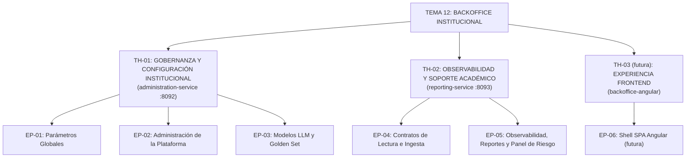

# Sprint 0 — BackOffice (Tema 12)

> **Entregable:** un único PDF por grupo (Propuesta de Sprint 0 + DoD + capacidad + épicas + historias de usuario). Este `.md` es la **fuente** desde la que se genera el PDF.

## 1. Propuesta de Sprint 0

### 1.1 Objetivo
Preparar las **bases de trabajo** del equipo para todo el proyecto: repositorios, entorno, estándares, contratos y backlog inicial. **No se implementan funcionalidades** en este sprint; sí se deja todo listo para que el Sprint 1 arranque con el **backend funcional** y un flujo demostrable.

### 1.2 Bases de trabajo (normas del equipo)
- **Tecnologías**: Java 21 + Spring Boot 3 + Maven · PostgreSQL · **Kafka** (Outbox + idempotencia + caché TTL) · Eureka + Config Server · API Gateway de plataforma (T01) · GitHub Actions (CI) · Testcontainers · OpenAPI/Swagger.
- **Git y revisión**: ramas `feature/*` + **Pull Request con revisión de ≥1 compañero** · mensajes convencionales (`feat:`, `fix:`, `docs:`) · `main` protegido (nada se mergea sin PR).
- **Calidad**: build Maven verde · **Clean Architecture** (sin reglas de negocio en controllers) · tests unitarios + integración (Testcontainers) · **sin secretos en el repo** (config por variables/`envsubst`).
- **Documentación**: `sdd/` + sitio **sincronizados** ante cualquier cambio · trazabilidad **`RF-XXX`**.
- **Contratos**: envelope de eventos estándar y naming de topics **acordados con los demás equipos** (T01/03/05/08/10) antes de implementar consumos.
- **Seguimiento**: todo el trabajo en **Taiga** (épicas → historias → tareas) · comunicación por el canal del equipo · revisión periódica del avance.

### 1.3 Tareas iniciales del Sprint 0
1. **Repos y git**: estructura confirmada en `Backoffice-TPI`, protección de `main`, CI (GitHub Actions) verde desde el arranque.
2. **Bootstrap de los 2 servicios**: `administration-service` y `reporting-service` (Spring Boot, PostgreSQL, Flyway, perfiles por entorno).
3. **Entorno compartido**: `docker-compose` completo (Kafka, PostgreSQL, Eureka, Config Server, Gateway simulado de T01).
4. **Contrato de eventos**: envelope estándar + topics (`administration.events`, etc.) coordinado con los equipos consumidores.
5. **DoD**: definirla (sección 2 de este documento) y cargarla en Taiga.
6. **Backlog en Taiga**: cargar épicas y primeras historias de usuario.
7. **Planificación del Sprint 1**: seleccionar historias según la **capacidad efectiva** del equipo (sección 3).

### 1.4 Resultado esperado del Sprint 0
Repos y entorno levantados · DoD definida · backlog inicial en Taiga · contrato de eventos acordado · **Sprint 1 planificado** con las historias que la capacidad permite.

## 2. Definition of Done (DoD)

> **Sobre la adaptación:** esta DoD no es una definición genérica. Cada condición se ancla a la **tecnología** del proyecto (Java/Spring, PostgreSQL, Kafka, RLS, OpenAPI), a nuestros **controles de calidad** (Testcontainers, Outbox + idempotencia, revisión de PR) y a nuestras **entregas** (`sdd/` + sitio sincronizados, Taiga, trazabilidad `RF-XXX`). Sigue la estructura profesional en niveles (tarea · historia · sprint · release).

**Aplicación:** una **tarea**, **historia de usuario**, **sprint** o **release** está *terminada* cuando cumple todas las condiciones de su nivel (y los niveles inferiores).

### Nivel 0 · Tarea
- Cumple sus **criterios de aceptación propios** (los definidos por tarea en `sdd/`).
- **Build verde** (`mvn clean verify`) · tests de la tarea pasando.
- **Cobertura de tests ≥ 90%** (objetivo: se intenta lograr siempre en lo posible).
- Una tarea se cierra solo cuando su **historia** también alcanza el **Nivel 1**.

### Nivel 1 · Historia de Usuario
- Cumple el **requisito citado (`RF-XXX`)** y sus **criterios de aceptación**.
- **Build verde** (`mvn clean verify`) · sin warnings críticos · **Clean Architecture** (sin reglas de negocio en controllers).
- **Tests** unitarios de dominio/casos de uso + **integración con Testcontainers** (PostgreSQL + Kafka) donde publique/consuma eventos.
- **Cobertura de tests ≥ 90%** (objetivo: se intenta lograr siempre en lo posible).
- **Outbox + idempotencia** verificados (por `event_id` y `version`).
- **Autorización por rol** probada (ADMIN/PROFESOR → 200/403).
- **Alcance multitenancy** verificado: RLS filtra por `course_id`; `ALL` solo ADMIN y auditado.
- **Contrato OpenAPI/eventos** documentado y coordinado con consumidores.
- **PR revisada por ≥1 compañero** · sin secretos en el repo.
- **`sdd/` + sitio sincronizados**.

### Nivel 2 · Sprint
- **Todas sus historias cumplen el Nivel 1**.
- **Sin regresiones**: suite completa verde al cierre.
- **Taiga actualizado** (estados correctos · capacidad respetada).
- **Revisión/demo del sprint lista** (flujo demostrable).
- **Retrospectiva realizada** y próximas acciones registradas.

### Nivel 3 · Release
- **`main` con CI verde** y **tag/versión**.
- **Desplegable**: imagen/entorno listo (Docker Compose, `envsubst`, sin Node en producción).
- **Contratos estables** y coordinados con los demás equipos (eventos + API).
- **Documentación de la release** alineada (sitio + `sdd/`).

> El frontend (app Angular + BFF) se agregará como bloque propio cuando lo definamos; por ahora la DoD cubre el **backend funcional**.

---

## 3. Capacidad del equipo

_Pendiente de completar._ El equipo está cargando el **Excel de 2 hojas** (`CAPACIDAD_SPRINT` + `RESUMEN`). Fórmula de referencia:

```
Capacidad efectiva = ((Días del Sprint − Ausencias) × Horas por día − Otras actividades) × % de dedicación
```

Los valores finales se incorporan en esta sección y se usan en la planificación de los Sprints.

---

## 4. Jerarquía de Producto y Temas Estratégicos

En metodologías ágiles (Scrum / SAFe), el backlog se estructura en niveles de abstracción:

```
Tema Estratégico → Épica → Historia de Usuario → Tarea Técnica
```

Para el **Tema 12 (Backoffice Institucional)** se definen **2 temas estratégicos de negocio** (+ 1 futura de frontend):



### Definición de los temas estratégicos

**TH-01 · Gobernanza y Configuración Institucional** — *quién tiene poder de actuar sobre la plataforma y bajo qué reglas*: humanos con rol **ADMIN** (EP-01/02) y **modelos de IA habilitados** (EP-03). Todas **escriben/deciden**, no solo muestran.
- Servicio responsable: `administration-service` (puerto 8092) · Épicas: EP-01, EP-02, EP-03.

**TH-02 · Observabilidad y Soporte Académico** — *la que muestra información en vez de gobernarla*: el **PROFESOR** solo consulta (no configura nada) y el **ADMIN** ve el consolidado.
- Servicio responsable: `reporting-service` (puerto 8093) · Épicas: EP-04 (habilitador de ingesta), EP-05.

**TH-03 · Experiencia de Usuario (futura)** — SPA Angular para los perfiles administrativo y docente (Caso A de cátedra: Angular SSR + Nginx + BFF).
- Componente responsable: `backoffice-angular` · Épica: EP-06 (futura).

---

## 5. Matriz de Trazabilidad y Backlog Priorizado

> Este es el **backlog general** (no está atado a un Sprint puntual): la capacidad del equipo define qué se toma en cada Sprint de planificación.

| Tema | Épica | Historia | Título | Rol | SP | Prioridad | Especificación |
|---|---|---|---|---|---|---|---|
| TH-01 | EP-01 | **US-01** | Modificación y versionado de parámetros globales (PAR-01..24) | ADMIN | 5 | Must | [uh/US-01.md](uh/US-01.md) |
| TH-01 | EP-01 | **US-02** | Propagación del cambio de parámetro (Outbox + caché con TTL) | Consumidores | 5 | Must | [uh/US-02.md](uh/US-02.md) |
| TH-01 | EP-02 | **US-03** | Asignación y revocación del rol administrador | ADMIN | 5 | Must | [uh/US-03.md](uh/US-03.md) |
| TH-01 | EP-03 | **US-04** | Registro, sustitución y conmutación de proveedores de IA | ADMIN | 5 | Must | [uh/US-04.md](uh/US-04.md) |
| TH-01 | EP-03 | **US-05** | Revisión de calidad de modelos de IA (golden set y tolerancia) | ADMIN / Sistema | 8 | Must | [uh/US-05.md](uh/US-05.md) |
| TH-02 | EP-04 | **US-06** | Recolección de datos de otros temas (ingesta y frescura) | Reporting / Sistema | 8 | Must | [uh/US-06.md](uh/US-06.md) |
| TH-02 | EP-05 | **US-07** | Panel docente con alumnos en riesgo | PROFESOR | 8 | Should | [uh/US-07.md](uh/US-07.md) |
| TH-02 | EP-05 | **US-08** | Tablero consolidado de indicadores (KPIs) | ADMIN | 8 | Should | [uh/US-08.md](uh/US-08.md) |
| TH-02 | EP-05 | **US-09** | Exportación de reportes | ADMIN / PROFESOR | 5 | Could | [uh/US-09.md](uh/US-09.md) |

> **Backlog general:** las historias **Must** suman `5+5+5+5+8+8 = 36 SP`. La **capacidad efectiva** (sección 3) define cuántas se toman por Sprint.

---

## 6. Historias de Usuario (especificación completa)

Cada historia está especificada con el **template del equipo** (`templateUH.md`): Descripción (Como/Quiero/Para) · Reglas de negocio · Validaciones · Criterios de Aceptación · BDD (Gherkin) · Prototipo · Estimación · Dependencias · **Tareas asociadas**.

### En simple (resumen por historia)

| Historia | En simple |
|---|---|
| **US-01** | El administrador cambia las reglas del juego desde una pantalla; cada cambio queda anotado y vale de ahora en adelante. |
| **US-02** | Cuando cambia una regla, el sistema avisa a los demás servicios sin perder el aviso; si algo se cae, siguen con el último valor. |
| **US-03** | El administrador da y quita el rol de administrador, con la garantía de que nunca quede la plataforma sin responsables. |
| **US-04** | El administrador elige qué proveedor/modelo de IA se usa, sin exponer las claves. |
| **US-05** | Todo modelo de IA se prueba contra respuestas de referencia antes de usarse y se vigila para que no se desvíe. |
| **US-06** | El sistema junta los datos de los demás temas y avisa si algún dato está desactualizado. |
| **US-07** | El profesor ve el estado de sus comisiones y avisa a tiempo cuando un alumno está en riesgo. |
| **US-08** | El administrador ve el tablero general de indicadores y recibe avisos cuando algo baja de lo esperado. |
| **US-09** | Se puede pedir un reporte en PDF/CSV y se avisa cuando está listo para descargar. |

### Archivos (template completo + tareas)

1. [US-01 · Modificación de parámetros globales](uh/US-01.md)
2. [US-02 · Propagación del cambio de parámetro (Outbox + caché)](uh/US-02.md)
3. [US-03 · Asignación y revocación del rol administrador](uh/US-03.md)
4. [US-04 · Registro y conmutación de proveedores de IA](uh/US-04.md)
5. [US-05 · Revisión de calidad de modelos de IA](uh/US-05.md)
6. [US-06 · Recolección de datos de otros temas](uh/US-06.md)
7. [US-07 · Panel docente con alumnos en riesgo](uh/US-07.md)
8. [US-08 · Tablero consolidado de indicadores](uh/US-08.md)
9. [US-09 · Exportación de reportes](uh/US-09.md)

---

## Secciones pendientes (se agregan en orden)
- [x] **1. Propuesta de Sprint 0 + tareas iniciales**
- [x] **2. Definition of Done (DoD)**
- [ ] **3. Capacidad del equipo** (Excel 2 hojas + justificación)
- [x] **4. Jerarquía de Producto y Temas Estratégicos**
- [x] **5. Matriz de Trazabilidad y Backlog Priorizado**
- [x] **6. Historias de Usuario (especificación completa en `uh/`)**